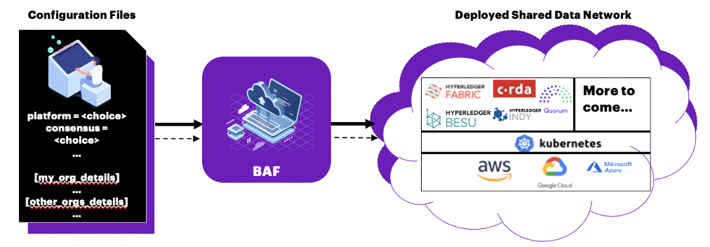
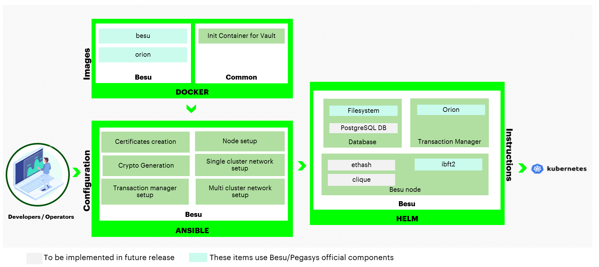

# HIP Identifer
Blockchain Automation Framework HIP v0.1

# Sponsor(s)
<mark>_**Sponsor(s)** name and contact details including email address_</mark>

- Tracy Kuhrt, Associate Director, Blockchain and Multiparty Systems Architecture at Accenture, TSC Co-Chair (tracy.a.kuhrt@accenture.com)

# Abstract
<mark>_**Abstract** (less than 50 word) description of the project._</mark>

The Blockchain Automation Framework (BAF) is an accelerator by which developers can consistently deploy production-ready distributed networks across public and private cloud providers.

# Context
<mark>_**Context** if any, what is this project derived from? What if any is it related to?_</mark>

In early 2019, Accenture started a project codenamed “Fulcrum” to simplify the use of best practices and accelerate DLT deployments. Our vision was to bring down the technology barriers and thus drive adoption of DLT. From the very beginning we had open source in mind.

We decided on some principles:
1.	**Design for security**: Keys and other credentials are not stored in source, configuration files, environment variables, or filesystems
2.	**Modular Design**: To provide an “enterprise” version, we should ensure that we are providing interfaces for modules where we might want to plug in a different component
3.	**Conform to DLT Reference Architecture**: When making decisions, conform to Accenture’s DLT Reference Architecture non-functional requirements, and principles
4.	**Open Source Components**: Ensure that we are using open source licensed products in our solution so that it may be contributed to Hyperledger, favoring Apache 2.0 licensed components
5.	**Infrastructure Independent**: Choose tools and components that do not limit lock-in to an infrastructure configuration or cloud provider

We then wrote down the problems we needed to solve while complying with the principles:
1.	How do we abstract the network complexities to let a developer majorly focus on application development?
2.	How do we make it easy and consistent for the developers to deploy different blockchain networks?
3.	How do we make it easy for the architects working on their first blockchain projects to design something secure, scalable, performant, and easy to maintain?
4.	How do we reduce the time taken in manual deployment from days to automated deployment in minutes?

Our customer conversations and Hyperledger community engagements helped us understand that these questions need to be answered not only at an organizational level but also at an industry/ecosystem level. For those familiar with building consortiums, it will be no surprise to hear that intellectual property concerns and fears of vendor lock-in can present major roadblocks in collaboration. Hence, we designed a solution that would not just accelerate adoption of the technology for Accenture customers but would also be open source and accessible to all, simplifying the deployment of the technology and accelerating adoption for the entire market.

In October, 2019, Accenture [proposed](https://github.com/hyperledger-labs/hyperledger-labs.github.io/pull/102) Blockchain Automation Framework to Hyperledger Labs [1]. It was quickly approved by the Lab stewards, and the code and documentation that we had written was contributed.

In the [Hyperledger Labs environment](https://github.com/hyperledger-labs/blockchain-automation-framework), we have been working with others in the community and performing a number of releases. We have a chat channel ([#blockchain-automation-framework](https://chat.hyperledger.org/channel/blockchain-automation-framework)), a [wiki page](https://wiki.hyperledger.org/display/labs/Blockchain+Automation+Framework+lab), [documentation](https://blockchain-automation-framework.readthedocs.io/en/latest/index.html), conduct regular community meetings, and have a [roadmap](https://blockchain-automation-framework.readthedocs.io/en/latest/roadmap.html) for tracking ongoing and future work. Blockchain Automation Framework is already being used in production deployments and has an active community.

# Dependent Projects
<mark>_**Dependent Projects** if any, must be listed, and each dependent project\'s maintainers must sign off on the proposal before it is considered by the TSC._</mark>

BAF utilizes:
* [Ansible](https://docs.ansible.com/ansible/latest/index.html) is an automation command line tool that helps IT technicians easily achieve system configuration, software deployment and other complex tasks in orchestration. BAF extensively uses Ansible playbooks along with roles to spin up a DLT/Blockchain network.
* [Kubernetes (K8s)](https://kubernetes.io/) is an open-source system for automating deployment, scaling and maintaining containerized applications. BAF leverages Kubernetes’ various features for deploying a DLT/Blockchain network along with other required services in one or more K8s clusters.
* [Helm](https://helm.sh/) is a package manager for K8s. Helm Charts are configuration files designed for K8s to help define, install and upgrade complex K8s applications. BAF uses Helm Charts for designing and configuring the architecture of each DLT/Blockchain platform for its own network set-up.
* [HashiCorp Vault](https://www.vaultproject.io/) provisions a secure approach to store and gain secret information such as tokens, passwords and certificates. BAF relies on Vaults for managing certificates used in each node of a DLT/Blockchain network during the lifecycle of a deployment, and it is a prerequisite that the Vault is installed and unsealed prior to deployment of a DLT/Blockchain network.
* [GitOps](https://www.weave.works/technologies/gitops/) introduces an approach that can make K8s cluster management easier and also guarantee the latest application delivery is on time. BAF uses Weavework’s Flux for the implementation of GitOps and executes an Ansible role called setup/flux defined in the BAF GitHub repo.

In addition to the above tools, we are of course dependent on the releases made by other DLT platform projects. The deployment of DLT networks currently supported by BAF are:
* Hyperledger Fabric
* Hyperledger Besu
* Hyperledger Indy
* GoQuorum
* R3 Corda Open Source
* R3 Corda Enterprise

# Motivation
<mark>_**Motivation** for this project, a longer justification of the project may be a couple of hundred words. Why is this project better at solving a problem compared to parallel proposals or implemented projects?_</mark>

Setting up a new DLT/Blockchain network or maintaining an existing DLT/Blockchain network in a production-scale environment is not straightforward. For the existing DLT/Blockchain platforms, each has its own architecture, which means the same way of setting up one DLT/Blockchain network cannot be applied to others.

Therefore, when blockchain developers are asked to use an unfamiliar DLT/Blockchain platform, it requires significant effort for even experienced technicians to properly setup the DLT/Blockchain network. This is especially true in large-scale production projects across heterogeneous corporate environments which require other key aspects such as security and service availability.

Being aware of the potential difficulty and complexity of getting a production-scale DLT/Blockchain network ready, cloud vendors have provisioned their own managed Blockchain services (aka Blockchain as a Service or BaaS) to help alleviate various pain-points during the process. However, limitations can still be identified in these BaaS solutions (e.g., limited network size, locked to all nodes on a single cloud provider, limited choice of DLT/Blockchain platform).

The objective of BAF is to provide a consistent means by which developers can deploy production-ready distributed networks across public and private cloud providers. This enables developers to focus on building business applications, knowing that the framework upon which they are building can be adopted by an enterprise IT production operations organization. BAF is not intended solely to quickly provision _development_ environments which can be done more efficiently with other projects/scripts. Likewise, Blockchain Automation Framework is not intended to replace BaaS offerings in the market, but instead, BAF is an alternative when existing BaaS offerings do not support a consortium’s current set of requirements.

# Proposed Status
<mark>_**Status** of the project: See [project lifecycle](https://hyperledger.github.io/tsc/project-lifecycle.html)._</mark>

Incubation

# Solution
<mark>_**Solution** to the problem addressed in the motivation section. Try to make this as detailed as possible._</mark>

Blockchain Automation Framework delivers an automation framework for rapidly and consistently deploying production-ready DLT platforms to cloud infrastructure.

Blockchain Automation Framework makes use of Ansible, Helm, and Kubernetes to deploy production DLT networks. Specifically, it makes use of Ansible for configuration of the network by DevOps Engineers. It then uses Helm charts as instructions for deploying the necessary components to Kubernetes. Kubernetes was chosen to allow for Blockchain Automation Framework to deploy the DLT networks to any cloud that supports Kubernetes.

Blockchain Automation Framework currently supports Hyperledger Fabric, Hyperledger Besu, Hyperledger Indy, GoQuorum, R3 Corda Open Source and Enterprise. Other DLT platforms can easily be added.

## Hyperledger Fabric
For Hyperledger Fabric, we use the official Docker containers provided by that project. A number of different Ansible scripts will allow you to either create a new network (across clouds) or join an existing network.

## Hyperledger Besu
For Hyperledger Besu, we use the official Docker containers provided by that project. A number of different Ansible scripts will allow you to create a new network (across clouds).

### Hyperledger Indy
For Hyperledger Indy, we build Docker containers from our source code. A number of different Ansible scripts will allow you to create a new network (across clouds).

### Quorum
For Quorum, we use the official Docker containers provided by Quorum. A number of different Ansible scripts will allow you to either create a new network (across clouds) with choice of Consensus (between IBFT and RAFT) and a choice of Transaction Manager (between Tessera and Constellation).

### Corda Enterprise
For Corda Enterprise, we build Docker containers from the Corda source with licensed jars. A number of different Ansible scripts will allow you to either create a new network (across clouds) or join an existing network.

### Corda Opensource
For Corda Opensource, we build Docker containers from the Corda source. A number of different Ansible scripts will allow you to either create a new network (across clouds) or join an existing network.

# Effort and Resources
<mark>_**Effort and resources** committed (coders and any other resources that are needed) and timeline._</mark>

Since being accepted as a Hyperledger Lab in October 2019, BAF has had 39 total contributors with 32 contributors having more than one commit (based on metrics from the Hyperledger community tools project reports [2]). There have been 27 contributors in the past year and 15 contributors in the past 6 months. The [LF Insights Commit Report through July 18, 2021](https://tinyurl.com/yfckjkeu) [3], 2021 shows that there have been commits from at least 6 separate organizations.

# How To
<mark>_**How to**: How to host and test the project. How to deploy and use. How does one know that it works._</mark>

The Blockchain Automation Framework documentation [4] provides detailed [Operation Guide](https://blockchain-automation-framework.readthedocs.io/en/latest/operationalguide.html) and [Developer Guide](https://blockchain-automation-framework.readthedocs.io/en/latest/developerguide.html). In addition, a [supply chain sample application](https://blockchain-automation-framework.readthedocs.io/en/latest/example/supplychain.html) is provided for the general DLT platforms, and a [Hyperledger Indy reference application](https://blockchain-automation-framework.readthedocs.io/en/latest/example/indy-refapp.html) is provided for Hyperledger Indy. These sample applications allow the user to test their DLT deployments completed via BAF.

# References
<mark>_**References**. See [citation guide](http://www.chicagomanualofstyle.org/tools_citationguide.html)._</mark>

[1] [Blockchain Automation Framework Lab proposal](https://github.com/hyperledger-labs/hyperledger-labs.github.io/pull/102)

[2] [Hyperledger community tools project reports](https://github.com/tkuhrt/hyperledger-community-management-tools/tree/master/project-reports)

[3] [LF Insights Commit Report through July 18, 2021](https://tinyurl.com/yfckjkeu)

[4] [Blockchain Automation Framework Read the Docs](https://blockchain-automation-framework.readthedocs.io/en/latest/index.html)

# Closure
<mark>_**Closure** how do we know that the project succeeded. This has to be measurable if possible. Make references to successor projects if any._</mark>

Project success can be measured by the use of BAF to accelerate the deployment of production-ready DLT networks and nodes and  drive the adoption of DLT platforms.

# FAQ
Additional [FAQs](https://blockchain-automation-framework.readthedocs.io/en/latest/faq.html) can be found in the Blockchain Automation Framework documentation [4].

## What is the Blockchain Automation Framework?
The Blockchain Automation Framework is an automation framework for delivering consistent production ready DLT networks on cloud based infrastructures.

## How is Blockchain Automation Framework different from Blockchain as a Service (BaaS)?
* The Blockchain Automation Framework deployment scripts can be reused across cloud providers like AWS, Azure, GCP, DigitalOcean and OpenShift
* Can deploy networks and smart contracts across different DLT/Blockchain platforms
* Supports heterogeneous deployments in a multi-cloud, multi-owner model where each node is completely owned and managed by separate organizations
* Bring Your Own Infrastructure (BYOI) - You provide GIT, Kubernetes cluster(s), and Hashicorp Vault services provisioned to meet your specific requirements and enterprise standards
* No network size limit
* Specifies only the number of organizations and the number of nodes per organization in a network.yaml file uniquely designed in the Blockchain Automation Framework for a new DLT/Blockchain network set-up and its future maintenance
* Provides a sample supply chain application which runs on multiple DLT/Blockchain platforms that can be used as a reference pattern for how to safely abstract application logic from the underlying DLT/Blockchain platform

## What DLT Platforms are currently supported?
* Hyperledger Fabric
* Hyperledger Besu
* Hyperledger Indy
* GoQuorum
* R3 Corda Open Source
* R3 Corda Enterprise

See the [Compatibility Matrix](https://blockchain-automation-framework.readthedocs.io/en/latest/compatibilitymatrix.html) for specific information and versions.
