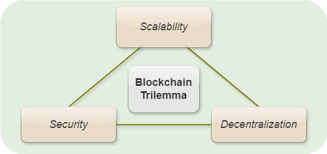

# HIP Identifier
Hyperledger Waterfall Network v1.0

# Sponsor(s)

- Ron Resnick [<ron@bluewave.global>](mailto:ron@bluewave.global)
- Richard Wang [<rwang@draperdragon.com>](mailto:rwang@draperdragon.com)
- Jeff McDonald [<jeff@waterfall.network>](mailto:jeff@waterfall.network)
- Michael Terpin [<michael@transformventures.io>](mailto:michael@transformventures.io)
- Dmytro Dmytryshyn, ScD [<dmitrishin@op.edu.ua>](mailto:dmitrishin@op.edu.ua)
- Sergii Grybniak, PhD [<sergii@bluewave.globall>](mailto:sergii@bluewave.global)
- Oleksandr Nashyvan [<on@waterfall.network>](mailto:on@waterfall.network)
- Yevhen Leonchyk, PhD [<leochyk@onu.edu.ua>](mailto:leochyk@onu.edu.ua)
- Igor Mazurok, PhD [<mazurok@onu.edu.ua>](mailto:mazurok@onu.edu.ua)
- Ruslan Shanin, PhD [<ruslanshanin@onu.edu.ua>](mailto:ruslanshanin@onu.edu.ua)
- Vladimir Mezin, PhD [<vladimir@waterfall.network>](mailto:vladimir@waterfall.network)

# Abstract

[Waterfall](https://waterfall.network/) is a highly scalable smart contract network for the development of various
decentralized applications (DApps).
The distributed protocol is based on DAG (Directed Acyclic Graph) technology, with a 2-level fast finality
Proof-of-Stake (PoS) consensus protocol, in which millions of validators can participate.
It challenges the trilemma of scalability, security, and decentralization by bringing the combination of scalability and
decentralization on a new level.

Waterfall integrates with the Ethereum Virtual Machine (EVM) that all Ethereum-based apps can be run on this network.
Therefore, Waterfall can ensure a favorable environment for the provision and consumption of a wide spectrum of
enterprise-class services for business and social activities, in a convenient format within the framework of
a decentralized network.

# Context

Despite its potential, DLT is still an innovative technology, and some challenges need to be addressed.
One of the main obstacles is scalability, as the current generation of DLTs can only handle a limited number of
transactions per second without compromising on security and/or increased overall network centralization – 
the so-called trilemma of scalability, security, and decentralization.

Vitalik Buterin, the creator of Ethereum, the currently most decentralized smart contract network,
formulated the blockchain trilemma: of the three chief characteristics of DLT – decentralization, security, and
scalability – a distributed system can only have two.
In many cases, this trilemma boils down to a simple tradeoff between scalability and decentralization,
since security in fintech is non-negotiable.
Vitalik Buterin clearly highlighted all the advantages and disadvantages in his article "[Endgame](https://vitalik.eth.limo/general/2021/12/06/endgame.html),"
which can be summarized as "distributed systems cannot be scalable and decentralized at the same time, and that is fine."

As DLT continues to gain popularity and widespread adoption, it is essential to explore new solutions and refine
existing ones to address the scalability challenge.
Nowadays, increasing scalability, security, and decentralization remain a primary concern for the mass adoption of
decentralized services, especially at the enterprise level.

# Dependent Projects

None.
Waterfall was derived from Prysm and Go-Ethereum.
However, at present, the project does not depend on further Ethereum development.

# Motivation

A well-known problem that concerns both users and developers is that an increasing throughput,
transactions per second (TPS), is usually in conflict with decentralization, and a balance should be found.
At the same time, centralized payment systems measure this value in the thousands.
For example, VISA processed almost [7,000 TPS on average in 2023](https://s29.q4cdn.com/385744025/files/doc_downloads/2023/Visa-Inc-Fiscal-2023-Annual-Report.pdf),
and if the demand should arise, this value can be increased by several times.
Currently, the development of scalable networks with custom features has gained significant traction and
it is considered one of the crucial factors for the mass adoption of DLTs, especially in enterprise-class applications.

There are multiple approaches to overcome the limitation of scalability, among the most popular being sharding and
Layer 2s (L2s).
Sharding splits a distributed system into smaller, more agile systems, so it can handle more transactions.
Layer 2 refers to a network or technology that operates on top of an underlying protocol to improve its scalability and
efficiency.
As a result, the entire system becomes decentralized and scalable.
But when we split the whole into parts, its components suffer from the same decentralization and scalability tradeoff.
Shard chains are essentially distributed systems.
L2s are also mostly distributed systems, achieving scalability by sacrificing decentralization.

The prime goal of Waterfall is to provide a high-performance scalable ecosystem for the development of DApps in
various fields such as DeFi, DePIN, GameFi, IoT, Enterprise, etc.

# Status

Proposed for Incubation.

The Waterfall Main network has been operating steadily with thousands of validators since June 2024.
[Current statistics](https://waterfall.network/individuals#statistics_block) are available online.

At present, our R&D team actively keeps on working on the system design and adding new features such as light validators for
mobile devices, post-quantum cryptography, and zero knowledge mechanisms for our protocols as well as virtually
unlimited sharding and parallel processing of smart contracts.
We aim to achieve a virtually unlimited number of shards, which can lead us to virtually unlimited scalability while
preserving the decentralization of the entire system and each of its subsystems.

# Solution

The efficiency of the Waterfall network is dependent on successful collaboration between the Coordinating and
BlockDAG shards, which work in parallel.
Every system validator has two essential components: the coordinator and the verifier, both playing key roles within
their respective shards.
Waterfall implementation provides for the possibility of deploying several autonomous validators on each full node,
with a common ledger and a pool of transactions.
Such nodes are infrastructure objects deployed on separate computers (servers) and performing all operations for
sending and processing data.
This approach enables Waterfall to achieve scalability without sacrificing decentralization.

In a BlockDAG shard, all received transactions are first added to its DAG-based ledger and are applied to alter
the network state only after they are finalized in the Coordinating network since the DAG structure does not have
a natural ordering.
A registry of verifiers is responsible for assigning block producers in each slot at the start of each epoch.

The Coordinating network handles the crucial tasks of linearizing (ordering) and finalizing the BlockDAG ledger,
thereby enhancing security and synchronization across the entire system.
This network also holds information about the approved blocks generated on the BlockDAG shard.
Therefore, the execution of transactions and smart contract calls are separated from the consensus protocol.

With Waterfall, a specially developed subnetwork technology ensures scalability in terms of transaction processing
capacity within the shard networks; in other words, it provides horizontal sharding.
A transaction pool, the set of valid pending transactions to be recorded in blocks, is split between network verifiers by
applying a hierarchical and graph-based clustering algorithm.
All verifiers of the BlockDAG shard have the same ledger and the same general state of processing of all finalized blocks.
Thus, as the number of verifiers and transactions grows, the number of blocks in each slot will also increase.
Although, at the moment, subnetworks parallelize the validation of transactions and their inclusion in blocks,
further processing of blocks to include them in the ledger and change the current state is performed by the nodes of
all subnetworks.

At present, the network can process [over 10,000 TPS](https://docs.waterfall.network/tests/mainnet-test19), providing major benefits for developers and enterprises.
This high throughput ensures efficient processing, which is crucial for DeFi, IoT, Web3 gaming, and more.
Currently, on Waterfall, several projects, including Lightning Works, Indigo Nexus LLC, and WaterSwap DEX, 
are in the technical documentation stage.

Further parallel processing hierarchical sharding will be intended to decrease the total computational network load and
reduce volumes of stored data.
The fractal structure provides exponential growth in the number of supported shards that will allow for
virtually unlimited sharding.
As a result, it will allow us to create an unlimited number of heterogeneous shards forming the fractality,
with individual configurations covering numerous use cases in various fields that facilitate mass adoption of DLT,
especially in the enterprise sector.

To reduce transaction finalization time, Waterfall developed a fast finality two-level Proof-of-Stake (PoS)
consensus protocol with both full and optimistic finalities.
Since full finality takes a long time to achieve, a mechanism of optimistic finality represents a state that is highly
unlikely to be reversed, in other words, the probability of transaction rollbacks is extremely low.
This speeds up transaction finality, reduces waiting time, and enhances network efficiency.

Waterfall utilizes the EVM (full compatibility), which allows for easy migration.
Smart contracts for Ethereum could be literally copied and pasted, although porting more complex applications
may require changes in their code.
For example, it took only a few days for our team to adapt a copy of the open-source Uniswap project.
Reverse migration also works, which lowers risks for new applications.
In addition, the release and maintenance of embedded tokens (including NFTs) do not demand special smart contracts,
but are carried out with ordinary transactions that significantly reduce overhead charges while making their usage
more accessible to a wide range of users.

Join [the Waterfall network](https://waterfall.network) to learn about the latest developments!

# Effort and Resources

[The Waterfall network](https://waterfall.network) was initiated in 2021 and after more than three years of
development and testing, the Mainnet was successfully launched in June 2024.
Throughout the development process, [the Waterfall team](https://waterfall.network/community/our-team) has made
substantial contributions to the academic and professional community.
To date, [17 reviewed scientific articles](https://waterfall.network/developers/research-papers) have been published,
detailing various aspects of Waterfall.
Additionally, the team has actively participated in numerous conferences, where they have presented their findings and
engaged with other experts in the field.

The codes for the [coordinator](https://github.com/waterfall-network/coordinator) and the [verifier](https://github.com/waterfall-network/gwat)
are in the public domain.
The Ethereum library and binaries are licensed under the GNU Lesser General Public License v3.0 (LGPL-3.0) and
the GNU General Public License v3.0 (GPL-3.0) respectively.
The code written for the Waterfall project is distributed under the Apache License v2.0.

Security has been a top priority for the Waterfall project.
To ensure the network's robustness, the code underwent [an independent audit by the Hacken team](https://audits.hacken.io/waterfall/l1-waterfall-network-node-apr2024/),
a well-respected cybersecurity company.
The audit results confirmed the network's security, further boosting confidence in the project's integrity.

The Waterfall team maintains an open line of communication with its community through regular AMA (Ask Me Anything) sessions.
These sessions, which are recorded and available on the official [YouTube channel](https://www.youtube.com/@waterfall_network),
allow the community to stay informed and engaged with the latest developments.
Furthermore, the project has garnered significant attention and discussion across various social media platforms,
including [X (Twitter)](https://x.com/waterfall_dag), [Telegram](https://t.me/waterfall_network), and
[Discord](https://discord.gg/Nwb8aR2XvR), where community members actively participate in shaping the network's future.

We are working hard to grow interest, keep our audience informed about our development progress, ecosystem growth, and
educate them on how to use the Waterfall Network.
Currently, we have over 125,000 active members across our channels.
A prime goal is not just to increase the number of people in our channels but to find like-minded individuals who
share our vision.

# How To

To interact with the network, including sending transactions and calling smart contracts, a user must install [an EVM-compatible wallet](https://docs.waterfall.network/getting-started/metamask/).
Also, everyone can [run a mainnet node](https://docs.waterfall.network/tutorials/setup-docker-node-mainnet/) on
his/her device or a cloud-based service for participating in the consensus and block validating.
The minimum hardware requirements include a CPU with at least 2 cores and 4 GB of RAM.
There is [a native app](https://docs.waterfall.network/tutorials/setup-native-node-app/) for MacOS and Windows and
[infrastructure providers](https://waterfall.network/staking-infrastructure-providers) to facilitate the deployment process.
The list of [developer tools](https://waterfall.network/developers) is constantly expanding.

# References

1. [Repository for coordinator](https://github.com/waterfall-network/coordinator) 
2. [Repository for verifier](https://github.com/waterfall-network/gwat) 
3. [Repository for one-click app](https://github.com/waterfall-network/one-click-setup-app)
4. [Waterfall research papers](https://waterfall.network/developers/research-papers) 
5. [Waterfall Network on Medium](https://medium.com/@waterfall_network) 
6. [Waterfall news](https://waterfall.network/community?news)

# Closure

The success of the Waterfall project can be measured through several key indicators.
As a public decentralized network, its impact on the mass adoption of DLT is crucial.
Therefore, a significant increase in the number of validators and developers participating in the network,
alongside a growing user base, would demonstrate widespread engagement and trust in the network.
This growth in participants suggests that Waterfall is meeting the needs of its community and is being recognized as
a reliable and effective DLT solution.

Additionally, the proliferation of Web3 projects on Waterfall serves as a strong indicator of success.
A rise in the number of projects utilizing Waterfall would show that developers see the network as a viable foundation
for innovation, further proving its value and adoption in the broader Web3 ecosystem.
These metrics collectively provide a measurable way to assess the project's success.
