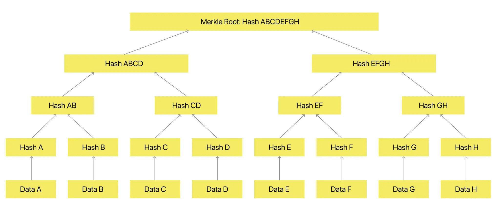

# HIP Identifier
OpenOrigins HOPrS v1.0

# Sponsor(s)
- Mansoor Ahmed, PhD - OpenOrigins (m@openorigins.com)
- Henrik Cox - OpenOrigins (henrik@openorigins.com)
- Matthew Pendlebury - Independent (matti@pendlebury.org)
- Matt Brown - OpenOrigins (matt@openorigins.com)
- Artem Kovtun - OpenOrigins (artem@openorigins.com)
- Alex Ross - OpenOrigins (alex@openorigins.com)

# Abstract
HOPrS (Human-Oriented Proof System) is a cryptographic framework that establishes trust in digital media through decentralized authentication and immutable provenance verification. HOPrS fingerprints digital content to detect manipulations and provide proof of authenticity. This solution addresses the challenges of misinformation, synthetic media, and copyright infringement, offering a scalable, open-source system.

# Context
Trust in content authenticity and provenance is increasingly challenged by the rise of synthetically generated media, sophisticated editing tools, and unauthorized manipulations of broadcast content. HOPrS (Human-Oriented Proof System) is a solution in this rapidly evolving landscape of digital media. The project is a natural extension of OpenOrigins’ goal of developing technologies that create decentralized media trust and verification.

HOPrS introduces a method to cryptographically fingerprint media files, enabling detailed detection of alterations and tamper-proof verification of authenticity. This work complements ongoing efforts in the Linux Foundation’s Decentralized Trust ecosystem, specifically aligning with principles of verifiable data and decentralized identity management.

While existing technologies address aspects of decentralized trust, HOPrS focuses on the underrepresented area of establishing trust in visual and media assets in a decentralized manner. Its design bridges the gap between decentralized trust and the authentication needs of media-heavy industries, including journalism, digital marketing, and social platforms.

By leveraging cryptographic principles and blockchain infrastructure, HOPrS integrates into decentralized ecosystems. Additionally, the system’s modular design allows for future collaboration and integration with both incubated and graduated Linux Foundation projects, strengthening its utility and adoption within the broader open-source community.

# Dependent Projects
**Blockchain Infrastructure (Eg Besu)**: HOPrS relies on blockchain technology to anchor cryptographic proofs.

We note here that HOPrS is designed to work with any blockchain/storage medium and does not necessitate the use of Besu specifically.

# Motivation
The rapid proliferation of manipulated media, synthetic content, and deepfakes poses a significant challenge to the trustworthiness of digital ecosystems. From the spread of misinformation to the misuse of copyrighted media, individuals and organizations face growing difficulties in verifying the authenticity of images and videos. Current solutions often rely on centralized systems, metadata tracking, or watermarking, which are either prone to tampering, inefficient at scale, or reliant on single points of trust.

**Key Challenges:**

• **Misinformation and Manipulated Media**: Deepfakes and altered media erode public trust, create confusion, and enable malicious actors to spread false narratives.

• **Authenticity Gaps in AI-Generated Content**: As generative AI tools become widely used, distinguishing between human-created and AI-generated media becomes increasingly difficult, leading to concerns about content provenance and trust.

• **Lack of Decentralized Verification**: Existing solutions rely heavily on centralized authorities or traditional tracking mechanisms, making them less resilient to tampering and less transparent.

# Status
- Incubation

HOPrS is in the development phase with a functional prototype demonstrating its ability to anchor media fingerprints and detect alterations. The solution has been validated in collaboration with OpenOrigins’ partners and is ready for open-source incubation.

# Solution
### **HOPrS: Human-Oriented Proof System**

HOPrS (Human-Oriented Proof System) is a cryptographic framework designed to provide tamper-proof authentication and verifiable provenance for digital media. It integrates perceptual hashing, quad-tree segmentation, and Merkle Tree cryptographic anchoring to ensure media authenticity while remaining resistant to minor modifications and adversarial manipulations.

Unlike traditional verification methods that rely on metadata tracking, watermarks, or centralized authorities, HOPrS anchors cryptographic fingerprints of media files to a blockchain, ensuring that authenticity can be independently verified while preserving privacy and efficiency.

### How HOPrS Works

1. **Perceptual Hashing – Feature Extraction**

Perceptual Hashing is a technique for producing a fingerprint (hash) of an image that represents the visual characteristics of that image. Visually similar images produce similar hashes, and the hamming distance (number of differing bits) between them can be used to determine how similar two images are. These are very different to cryptographic hashes whereby small changes should produce a very large difference (avalanche effect). A typical hash might be from 64-256 bits in length.

Perceptual hashing algorithms either compare characteristics of areas of images, such as the relative lightness compared to neighbours and the overall image coupled with the intensity of gradients in regions, or they decompose the image into sets of waves using Fourier related transformations and allow the hash to be calculated from parameters of those waves, or they use Convolutional Neural Networks to repeatedly merge neighbouring pixels.

- Extracts unique visual features from media to generate a perceptual hash.
- Resistant to minor modifications such as compression or noise but detects significant changes.
- Allows comparison between altered and original files.

2. **QuadTree Segmentation – Localizing Changes**

Quad trees are a technique for breaking a large image into a nested structure of smaller images. They are commonly used in video games, where there may be many objects on screen that need to be compared with each other. Using quad trees we can limit expensive operations like collision detection to pairs of objects that occupy the same small area of the screen, vastly reducing the total number of comparisons.

The image is divided into quarters, and each of those quarters is divided into quarters, and so on, down to some depth.

That depth may be uniform for the whole image, or some areas of the image may have more depth. For instance, a large area of the screen in a video game may have only a few objects, and therefore not be subdivided further.

In our case, the final depth is determined by the areas of the edited image that have differences from the the original. Areas without differences are shallow, areas with scattered differences descend to the boundary.

- Images are divided into a hierarchical quad-tree structure.
- Segmentation depth adapts based on the level of modification.
- Helps pinpoint specific areas of manipulation rather than treating an entire file as binary authentic/manipulated.

Figure 1: Test image - ’aeroplane’ Hawker Fury, Duxford 2023, taken by author on iPhone

Figure 2: Test image - ’aeroplane modified’ Yellow sun addition

Figure 3: Modifications - image is annotated with an overlay of the quadtrees

3. **Merkle Tree Cryptographic Anchoring – Immutable Proof of Authenticity**

A pointer is a reference to a position in a computer’s memory. A hash is a unique fingerprint of a chunk of data. Merkleization is replacing pointers with hashes.

We start by hashing the leaf objects, and then replace all the pointers to those leaf objects with hashes. We then find all the new leaf objects, which are objects that only had pointers to leaf objects in the original data structure and repeat with those. This terminates when no nodes with pointers remain, and the result is the Merkleized version of the original data structure.

Using a hash instead of a pointer means the object behind that hash can never change. It is permanent and immutable. Hashes are frequently used to reduce a large amount of data to a fixed amount – for instance, when a message is signed cryptographically it is actually the hash of the message that is signed, because that is generally much smaller than the message.

Merkleizing the MQP structure allows us to exclude branches while still matching the root hash that was signed. Without Merkleization we would need to provide the entire quadtree, which might be quite large, in order to match the signature. With Merkleization we can leave out most of the quadtree, yielding a significant space-saving optimization (more than 100x in most cases).

- Perceptual hashes from quad-tree segments are organized into a Merkle Tree.
- Each node stores a hashed representation of an image segment.
- The root hash is stored on the blockchain, allowing decentralized verification.

Figure 4: Merkle Tree creation

4. **Decentralized Traceability – Versioning and Provenance**
- Media versions are tracked over time.
- Each version maintains a cryptographic link to its previous iteration.
- Ensures integrity across multiple platforms and editing stages.

Figure 5: Provenance Tracking workflow chart

5. **Blockchain-Agnostic Verification**
    - HOPrS is not limited to a single blockchain.
    - Can integrate with multiple decentralized ecosystems (e.g., Ethereum, Hyperledger, IPFS).
    - Media verification is possible without needing access to the original file.

### Supporting Technologies

HOPrS supports OpenOrigins' broader end-to-end decentralized trust framework, which includes:

### Archive Anchoring

- A blockchain-based media timestamping system that provides immutable proof-of-existence.
- Initially adopted by ITN, anchoring 3+ petabytes of historical media archives.
- Ensures provenance tracking across decentralized networks.

### Secure Sourcing

- A trust framework for media capture and distribution, ensuring content authenticity from the point of origin.
- Useable by investigative journalism, forensic media teams, and insurance claim auditors to verify primary sources.
- Includes cryptographic attestation methods for secure content handling.

Archive Anchoring and Secure Sourcing create an integrated ecosystem for decentralized media trust, complementing several of the Linux Foundation’s incubated and graduated projects, such as CREDEBL’s identity and credentialing framework.

# Effort and Resources
OpenOrigins has a small engineering team specialized in blockchain technology, cryptography, and media verification for this project. Additionally, we are providing the necessary infrastructure to ensure the project’s success. We are establishing an open-source governance model to foster community engagement and collaboration.

Collaboration with interested contributors within the Linux Foundation community are welcomed to engage with the OpenOrigins engineering and product team to realize improvements to the system and discover new applications for the use of the technology.

# How To
**Hosting & Testing**

[• Public GitHub repository](https://github.com/openorigins)

[• Initial HOPrS documentation](https://openorigins.gitbook.io/openorigins-docs/human-oriented-proof-system-aka-hoprs/overview)

More robust documentation for HOPrS is currently being drafted.

# References
1. [OpenOrigins website](https://www.openorigins.com/)
    1. [Archive Anchoring Page](https://www.openorigins.com/archive-anchoring)
    2. Secure Sourcing page (doesn’t exist yet)
2. Cryptographic Foundations

• Merkle, R. (1987). *A Digital Signature Based on a Conventional Encryption Function*.

• Finkel, R. & Bentley, J. (1974). *Quad Trees: A Data Structure for Retrieval on Composite Keys*.

• Zauner, C. (2010). *Implementation and Benchmarking of Perceptual Image Hash Functions*.

# Closure
The success of HOPrS will be measured by its adoption as a decentralized media authentication standard within the Linux Foundation ecosystem. Key indicators of success include:

• Open-Source Contribution & Adoption – A growing community of contributors, maintainers, and external organizations integrating HOPrS into their workflows.

• Integration with LF Ecosystem – HOPrS being utilized alongside LF Decentralized Trust projects, such as CREDEBL for decentralized identity verification and Hyperledger for blockchain interoperability.

• Industry Adoption – Adoption by media organizations, investigative journalism platforms, and digital forensics teams to verify media authenticity at scale.

• Performance & Scalability Benchmarks – Demonstrated efficiency in media fingerprinting, tamper detection, and decentralized anchoring.

In the long term, the project aims to standardize cryptographic media provenance as a key component of decentralized trust frameworks, with HOPrS remaining a useful tool for combating misinformation and securing digital assets.