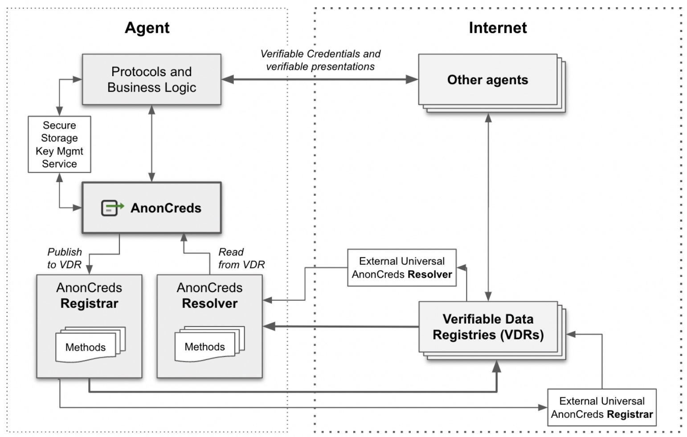

# Hyperledger AnonCreds Proposal

## Sponsor(s)

* _John Jordan, BC Gov, john.jordan@gov.bc.ca_
* _Stephen Curran, Cloud Compass Computing Inc., swcurran@cloudcompass.ca_
* _Steve McCown, Anonyome Labs, smccown@anonyome.com_
* _Bart Suichies, IOHK, bart.suichies@iohk.io_
* _Andre Kudra, esatus AG, a.kudra@esatus.com_
* _Víctor Martínez Jurado, SICPA, victor.MartinezJurado@sicpa.com_
* _Timo Glastra, Animo Solutions, timo@animo.id_
* _Sam Curren, Indicio, sam@indicio.tech_
* _Mirko Mollik, TrustCerts, mollik@trustcerts.de_
* _Belsy Yuen, Nymlab.it, belsy@nymlab.it_
* _Egidio Casati, Nymlab.it, egidio@nymlab.it_
* _Artur Philipp, Technical University Berlin (SNET), a.philipp@tu-berlin.de_
* _Line Kofoed, Bloqzone, [line.kofoed@bloqzone.com](mailto:line.kofoed@bloqzone.com)_
* _Ian Costanzo, Anon Solutions, [ian@anon-solutions.ca](mailto:ian@anon-solutions.ca)_
* _Keith Kowal, Swirlds Labs (Hedera), [keith.kowal@swirldslabs.com](mailto:keith.kowal@swirldslabs.com)_
* _Alessandro Sorniotti, Researcher in applied cryptography and system security, IBM Research Europe - Zurich, Switzerland (aso@zurich.ibm.com)_
* _Jens Jelitto, Senior Research Scientist, IBM Research Europe - Zurich, Switzerland ([jje@zurich.ibm.com](mailto:jje@zurich.ibm.com))_
* _Mathieu Glaude, Northern Block, [mathieu@northernblock.io](mailto:mathieu@northernblock.io)_
* _Rodolfo Miranda, RootsID, [rodolfo.miranda@rootsid.com](mailto:rodolfo.miranda@rootsid.com)_
* _Ariel Gentile, 2060.io, [a@2060.io](mailto:a@2060.io)_
* _Toby Tremayne, Magic Industries [toby@magicindustries.net](mailto:toby@magicindustries.net)_
* _Hakan Yildiz, Technical University Berlin (SNET), [hakan.yildiz@tu-berlin.de](mailto:hakan.yildiz@tu-berlin.de)_
* _Will Abramson, Edinburgh Napier University, [will.abramson@napier.ac.uk](mailto:will.abramson@napier.ac.uk)_
* _Alexander Shcherbakov, DSR Corporation, [alexander.sherbakov@dsr-corporation.com](mailto:alexander.sherbakov@dsr-corporation.com)_
* _Philippe Bourque, MCN - Québec, [philippe.bourque@mcn.gouv.qc.ca](mailto:philippe.bourque@mcn.gouv.qc.ca)_
* _Joelson Piaia, MCN - Québec, [Joelson.Piaia@mcn.gouv.qc.ca](mailto:Joelson.Piaia@mcn.gouv.qc.ca)_
* _Ourida Amrane MCN - Québec [Ourida.Amrane-ext@mcn.gouv.qc.ca](mailto:Ourida.Amrane-ext@mcn.gouv.qc.ca)_
* _Daniel Bachenheimer, Digital Identity Innovations Technology Lead, Accenture, [daniel.bachenheimer@accenture.com](mailto:daniel.bachenheimer@accenture.com)_

## Abstract

Hyperledger AnonCreds is a type of verifiable credential that supports important privacy-protecting capabilities based on zero-knowledge proof cryptography. The privacy-by-design capabilities of AnonCreds make them particularly important for identity use cases such as those implemented by the combination of [Hyperledger Aries](https://www.hyperledger.org/use/aries) and [Hyperledger Indy](https://www.hyperledger.org/use/hyperledger-indy). The AnonCreds project consumes the cryptographic support provided by [Hyperledger Ursa](https://www.hyperledger.org/use/ursa) for generating public/private key pairs, generating special primes, using private keys for generating signatures, and using public keys for verifying signatures.

## Context

Hyperledger AnonCreds is a specification of the AnonCreds verifiable credential data model/interactions, implementations of open source versions of the specification, test suites, and interfaces for publishing and retrieving AnonCreds objects. AnonCreds objects can be published to DLTs, such as Hyperledger Indy or [Fabric](https://www.hyperledger.org/use/fabric), blockchains such as Ethereum (using [Hyperledger Besu](https://www.hyperledger.org/use/besu)) or other Ethereum client implementations, or even centralized systems, such as web servers. AnonCreds verifiable credentials and presentations are passed between issuers, holders and verifiers in an AnonCreds-specific format today, and will use the [W3C Verifiable Credential Data Model Standard v1.1](https://www.w3.org/TR/vc-data-model/) (and greater) in the near future.

Several AnonCreds open source implementations are part of the Hyperledger Indy project, and [one of those implementations](https://github.com/hyperledger/indy-shared-rs/tree/main/indy-credx) will be the basis of a new, ledger-agnostic AnonCreds open source implementation. The implementation will be made agnostic to where the AnonCreds objects are published, still supporting Hyperledger Indy, but also other Verifiable Data Registries (VDRs).

The [AnonCreds specification](https://anoncreds-wg.github.io/anoncreds-spec/) uses the Linux Foundation JDF [Community Specification License v1.0](https://github.com/CommunitySpecification/1.0) and can be safely moved into the Hyperledger project under the same License. The Community Specification License from the Linux Foundation can be thought of the specification equivalent to an open source software license. The idea is that instead of every spec-creation organization defining their IP management License when collaborating on a spec, a common license is developed by a reputable organization (like LF) that knows what it is doing. An organization contributing to specifications can do a legal review of the License once, and when joining future specification activities that use the same license, they would know what they were getting into. Versions of the AnonCreds specification will be incubated within the project, and then might be submitted to a standards organization.

## Dependent Projects

The project has grown out of the Hyperledger Aries/Indy community. Once the AnonCreds technology has been migrated to a standalone project, AnonCreds will no longer be dependent upon Indy. The AnonCreds project consumes the cryptographic support provided by [Hyperledger Ursa](https://www.hyperledger.org/use/ursa) for generating public/private key pairs, generating special primes, using private keys for generating signatures, and using public keys for verifying signatures.

## Motivation

The motivation for creating Hyperledger AnonCreds is to extract an important, privacy-protecting verifiable credential technology from being explicitly tied to Hyperledger Indy and to enable its use with any appropriate Verifiable Data Registry (VDR). While Hyperledger Indy is a fantastic platform for sharing AnonCreds objects, it is not the only one, and this transition of AnonCred to a standalone project enables users invested in other distributed storage platforms to use AnonCreds.

AnonCreds is important because it is based on a number of important ZKP-based privacy-protecting capabilities that are not currently available with other types of verifiable credentials. These include:

* The act of presenting claims from AnonCreds verifiable credentials does not expose correlatable identifiers for the holder. This is particularly important for some governments as it means the use of AnonCreds verifiable credentials does not require the introduction of a new identifier for individuals, and the corresponding legislative overhead that creates. The non-correlatability of presentations from holders to verifiers addresses growing global privacy regulation trends like [GDPR](https://gdpr.eu/what-is-gdpr/).
* AnonCreds supports the notion of a ZKP-based “link secret” that enables binding of issued credentials to a holder, and the binding of multiple credentials presented together to the same link secret/holder.
* AnonCreds allows for the minimization of data sharing by supporting both selective disclosure (sharing only some claims in a credential) and ZKP predicates (proving a claim-based expression, such as “I’m older than 21” based on date of birth without having to share date of birth).
* AnonCreds verifiable presentation can include claims derived from multiple source verifiable credentials, with a binding proving the credentials were all issued to the same holder.
* Verifiable presentations using AnonCreds are derived from their source verifiable credentials, and so the holder is not providing the verifier with their raw / original verifiable credential.

By separating AnonCreds from Indy, a broader adoption of AnonCreds is enabled, as groups considering using AnonCreds would not be limited to an Indy-based deployment. With a broader user base comes additional interest in evolving AnonCreds, and we expect to see as a result additional interest from applied cryptographers. While many have successfully deployed solutions based on AnonCreds across the world, it is not a perfect solution and needs to continue to evolve. Revocation in today’s AnonCreds is less than ideal. Other signature schemes hold promise for a “better, faster” AnonCreds. With AnonCreds as a standalone project, efforts on the next generation of AnonCreds will be a focus. Such evolutions must retain the privacy-protecting capabilities of AnonCreds like non-correlation, selective disclosure, predicates and unlinkability, while improving how those capabilities are implemented.

## Status

A new Hyperledger AnonCreds project would move very quickly to the “Graduated” status. The technology underlying AnonCreds dates back to 1998, with the core cryptographic algorithms published in 2004/2005. Hyperledger Indy is at least the second complete implementation (following [IDMixer](https://idemix.wordpress.com/), and possibly others). As we have recently found in the specification of AnonCreds and its use with other than Indy deployments, very little needs to be done to use AnonCreds with VDRs other than Indy. Most of the underlying infrastructure for the project is in place, including a community ready to move the technology forward.

## Solution

The Hyperledger AnonCreds project will consist of the following elements:

* A Rust open source repository containing the implementation of AnonCreds currently in the Hyperledger Indy repository [indy-shared-rs](https://github.com/hyperledger/indy-shared-rs). The AnonCreds implementation will be separated from that repository, and minimally adjusted to provide a clear API for publishing and reading AnonCreds objects, and for producing current AnonCreds or W3C Verifiable Credential Data Model v1.1 verifiable credentials and presentations. Wrappers for the use of the C-callable Rust library will be provided for some languages, particularly those being used in Aries (Python, JavaScript, Java at least).
  * Other implementations of AnonCreds may be added over time.
* The JDF-based, [Community Specification v1.0](https://github.com/CommunitySpecification/1.0/blob/master/1._Community_Specification_License-v1.md)-licensed [AnonCreds Specification](https://anoncreds-wg.github.io/anoncreds-spec/), and its related [AnonCreds Methods Registry](https://anoncreds-wg.github.io/anoncreds-methods-registry/), along with the [Working Group](https://github.com/AnonCreds-WG) documenting the AnonCreds Specification will move to Hyperledger AnonCreds. The AnonCreds Methods registry contains a list of implementations of using AnonCreds with different distributed storage platforms, such as Hyperledger Indy, [cheqd.io](https://cheqd.io/), Hyperledger Fabric, Web Servers and so on.
* Open source implementations of various AnonCreds methods. Some AnonCreds methods (conceptually similar to [DID methods](https://github.com/w3c/did-spec-registries) in the [W3C DID Standard](https://www.w3.org/TR/did-core/)) may be hosted within Hyperledger AnonCreds, while others may be maintained in separate open or even closed source repositories. For example, AnonCreds Methods for using legacy Indy and `did:indy` would likely be sourced within the project, and other methods like HTTP (and/or `did:web`), Fabric and Besu are good candidates to be sourced within the AnonCreds project.
* A documentation repository published to a GitHub Pages-type site will be created that provides business and developer audiences the information they need to understand and use AnonCreds.
* An AnonCreds test suite designed along the lines of the [Aries Agent Test Harness](https://aries-interop.info) to test AnonCreds implementations conformance to the specification and interoperability.
* Working groups focused on “AnonCreds Next”, a new generation of AnonCreds that retains the important, privacy-protecting capabilities of AnonCreds, but builds on newer and more powerful cryptographic approaches.
* Possibly a “universal AnonCreds resolver” that can resolve and return any public AnonCreds object given its URI.
* All other Hyperledger top-level project elements, including a set of maintainers, marketing materials, project health monitoring and a cool logo.

We expect that those interested in publishing AnonCreds objects to their “ledger of choice” will implement an AnonCreds Method for their platform, such as Hyperledger Fabric or Besu. AnonCreds issuers can choose a platform to which their verifiable credentials will be rooted. Those interested in holding or verifying AnonCreds credentials can include specific resolvers in their applications or may even use an “universal AnonCreds resolver” to handle credentials rooted in any ledger (Verifiable Data Registry). Those using the Hyperledger Aries frameworks currently supporting AnonCreds would continue to have AnonCreds support.

### Architecture

The following shows how the AnonCreds component will interact with the various components of an SSI Agent, the key management service for an Agent, other Agents and Verifiable Data Registries (VDRs). Note the AnonCreds Registrar and Resolver methods that define the behavior of writing and reading AnonCreds to a specific VDR.

The “to-be” architecture is conceptually similar to what we have today with Hyperledger Indy, extended by separating AnonCreds into its own library and formalizing ledger-independent APIs between AnonCreds and the Registrar/Resolver methods. As indicated by the number of independent implementations already created using the existing AnonCreds libraries (6 and counting…), the adjustment of the APIs is a relatively small effort. Of course, with the implementation of registrar/resolver APIs, it becomes much easier to use VDRs other than Indy, particularly for resolver-only (holder and verifier) use cases. Other than a change in dependencies within Aries Frameworks, there should be little to no impact on the use of AnonCreds by existing implementations.

The broader community and subsequent broader focus on AnonCreds “Next” will bring about significant improvements in the capabilities, especially in the areas of revocation and additional signature schemes that retain the features of AnonCreds.

### Potential Objections

There are some in the larger verifiable credentials community that are dismissive of the AnonCreds approach, such as was voiced in a recent blog post by Kaliya Young (aka Identity Woman) about Indy, Aries and AnonCreds. We believe that most of the objections date back to the early days of the Hyperledger Indy project, which was closely associated with a specific vendor and deployment of Indy. We believe such views demonstrate a lack of understanding about the significant evolution of especially Hyperledger Aries and AnonCreds since those early days, and the importance of using ZKP-based approaches in verifiable credential/digital identity and trust use cases. Several in the Indy/Aries/AnonCreds community responded to the post, while others continue to focus on moving the technology forward.

Specifically related to AnonCreds in the blog post were concerns about the use of link secrets, and in general on the use of CL-Signatures cryptography. A response to the reference in the post on the use of link secrets was published by [Daniel Hardman here](https://www.evernym.com/blog/no-paradox-here-zkps-deliver-savvy-trust/) to explain their use. While CL-Signatures are not NIST-approved, the cryptography has been the subject of some less formal assessments (including [this assessment](https://www.hyperledger.org/wp-content/uploads/2022/05/URSA-IDLab-Code-Review.pdf) by Hyperledger and the [Digital Identity Laboratory of Canada](https://www.idlab.org/)) and has not been found to be fundamentally flawed. However, we do want to continue to evolve the signature scheme used in AnonCreds while retaining its privacy-protecting properties. That is a big part of the [motivation](#motivation) for putting forth this proposal.

The transition of AnonCreds from within the Indy project to independent of Indy, support for other VDRs, and supporting AnonCreds credentials and presentations using the W3C Verifiable Credential Data Model standard will likely blunt much of the criticism of AnonCreds.

### Open Source License and Trademarks

As the existing code is already in Hyperledger repositories, and the open source code changes we are proposing will occur also within Hyperledger repositories, there should be no licensing impacts, with all code using the Apache 2.0 license.

We are not aware of any trademarks held on AnonCreds. It is a term that has evolved within the Hyperledger Indy project to reference exactly what we want to now make into a separate Hyperledger project.

## Effort and Resources

The initial effort and resources for the AnonCreds will come from the large community of Hyperledger Indy and Aries developers. Added to that will be contributors from organizations interested in using AnonCreds on other than Indy VDRs. We believe that as the use of AnonCreds becomes more popular because of this transition that we will attract cryptographers and other developers supporting AnonCreds “Next.”

Once the project is defined, we expect that the extraction of AnonCreds from Indy will occur in a matter of months — ideally before the end of 2022. The implementation of the initial AnonCreds Methods within Hyperledger will occur in parallel (so-called “Indy legacy” and “did:indy” AnonCreds Methods, as well as HTTP), which enable a smooth transition for Hyperledger Indy-based deployments as well as to support integration testing of the implementation.

Work on the specification will continue with the addition of needed support from Hyperledger (Wiki, visibility), and with contributions from those outside of the Indy community. The working group’s efforts will expand beyond the current v1.0 specification and into the AnonCreds “Next” — the v2.0 specification.

We expect that a number of the people in the Sponsor’s list will contribute to the business and technology of the AnonCreds project. From that list, candidates for being maintainers on the project include the following, most of whom are well-known contributors on various Hyperledger projects:

* Stephen Curran
* Víctor Martínez Jurado
* Andrew Whitehead
* Timo Glastra
* Sam Curren
* Mirko Mollik
* Belsy Yuen
* Egidio Casati
* Artur Philipp
* Ian Costanzo
* Alessandro Sorniotti
* Rodolfo Miranda

## How To

Hyperledger AnonCreds will continue to work seamlessly with the Hyperledger Aries frameworks that use AnonCreds today. Each framework will evolve minimally to use the new dependencies and to support at least the Indy legacy registrar and resolver Method. As more methods become available, Aries Frameworks will add support for additional AnonCreds methods such as support for [cheqd.io](https://cheqd.io/), [Fabric](https://www.hyperledger.org/use/fabric) and [Ethereum](https://ethereum.org/en/) (perhaps based on [Besu](https://besu.hyperledger.org/) and using the [Sidetree protocol](https://identity.foundation/sidetree/spec/)).

In extracting the AnonCreds implementation from its existing Indy repository, the code will be minimally restructured to support AnonCreds Methods. Initial support will enable automated integration testing based on a ledger-less implementation, such as using an AnonCreds Method using plain HTTP. Once that is in place, an [Aries Agent Test Harness](https://aries-interop.info) infrastructure will be put in place to enable testing different AnonCreds and AnonCreds Methods implementations. As well, Aries Agent Test Harness itself will be used for continuous testing of AnonCreds across existing Aries Frameworks, as each evolves to use the new dependencies and a range of AnonCreds Methods.

The AnonCreds Specification Working Group will continue to meet every 1 to 2 weeks (as it has for the last 6+ months) to guide the project, focusing on the direction of the AnonCreds open source implementation, the development of AnonCreds Methods, completing the specification for submission to a standards organization, and defining the version v2.0 AnonCreds specification.

## References**

* [AnonCreds v1.0 Specification](https://anoncreds-wg.github.io/anoncreds-spec/) (status: draft)
* Lodder, M., Zundel, B., AnonCreds Protocol [generated](https://github.com/hyperledger/indy-hipe/blob/c761c583b1e01c1e9d3ceda2b03b35336fdc8cc1/text/anoncreds-protocol/README.md), [latex source](https://github.com/hyperledger/indy-hipe/blob/c761c583b1e01c1e9d3ceda2b03b35336fdc8cc1/text/anoncreds-protocol/supporting-docs/anoncreds.tex)
* Abramson, Will (2020). CL-Signatures [overview](https://wip-abramson.dev/cl-signatures)
* Chaum, David (1998) Blinded Signatures. \
[https://sceweb.sce.uhcl.edu/yang/teaching/csci5234WebSecurityFall2011/Chaum-blind-signatures.PDF](https://sceweb.sce.uhcl.edu/yang/teaching/csci5234WebSecurityFall2011/Chaum-blind-signatures.PDF)
* Camenisch, J., Lysyanskaya, A. (2001). An Efficient System for Non-transferable Anonymous Credentials with Optional Anonymity Revocation. In: Pfitzmann, B. (eds) Advances in Cryptology — EUROCRYPT 2001. EUROCRYPT 2001. Lecture Notes in Computer Science, vol 2045. Springer, Berlin, Heidelberg. [https://doi.org/10.1007/3-540-44987-6_7](https://doi.org/10.1007/3-540-44987-6_7)
* Camenisch, J., Lysyanskaya, A. (2005). Signature Schemes and Anonymous Credentials from Bilinear Maps.
  [http://cs.brown.edu/people/alysyans/papers/cl04.pdf](http://cs.brown.edu/people/alysyans/papers/cl04.pdf)
* Using [Hyperledger Fabric as a VDR for AnonCreds](https://github.com/crubn/fabric-aries) verifiable credentials ([presentation](https://wiki.hyperledger.org/download/attachments/71698768/video1974150021.mp4?api=v2)).

## Closure

The measure of success for the AnonCreds project is, like all Hyperledger projects, a combination of use in the wild (are organizations adopting the use of AnonCreds?) and contributors. For AnonCreds in particular, the focus of contributors will be less on evolving what we have (the easy parts), but on three goals outside of what exists today with AnonCreds as part of Indy. Those are:

1. Implementations of AnonCreds Methods to Verifiable Data Registries other than Indy, and the use of those Methods in real world use cases. This includes support for other Hyperledger projects like Fabric and Besu.
2. Completion of the specification.
3. Work on AnonCreds “Next” with at least a new revocation scheme and new signatures.

Specific metrics for those would be:

1. At least 6 AnonCreds methods within the next year.
2. A completed v1.0 specification within 6 months.
3. An active working group with a solid v2.0 definition within 6 months, including active work by cryptographers.

Completion of the project is at this point undefined. While we think AnonCreds v1.0 has several years of viability, a key goal of establishing this project is to provide a foundation for AnonCreds v2.0 (and beyond), providing many years of work in the open.
