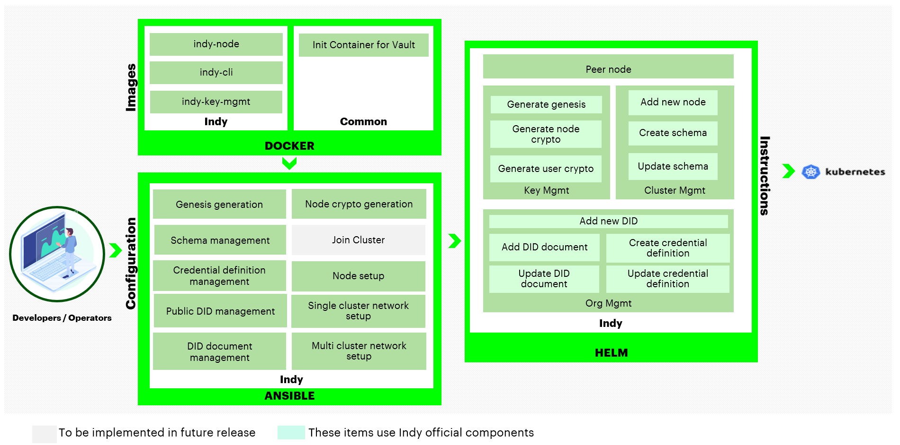
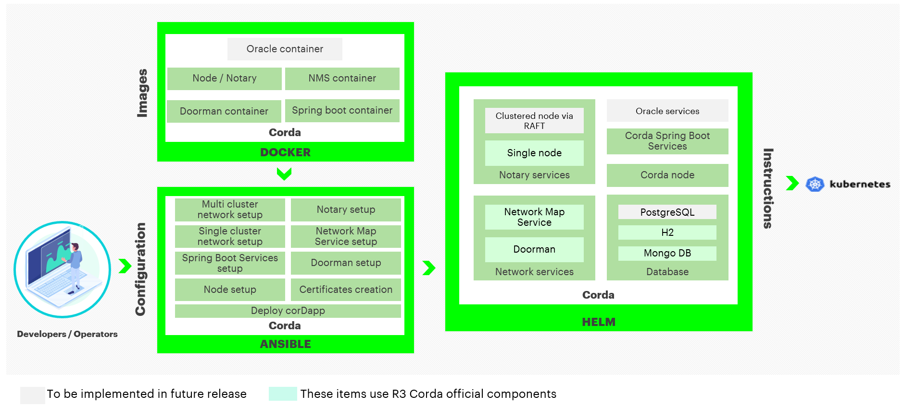

# HIP Identifer
Hyperledger Bevel (formerly Blockchain Automation Framework) HIP v0.1

# Sponsor(s)
- Tracy Kuhrt, Associate Director, Blockchain and Multiparty Systems Architecture at Accenture, TSC Chair (tracy.a.kuhrt@accenture.com)
- Nate McKervey, Head of Blockchain and DLT at Splunk (nmckervey@splunk.com)
- Ankit D Mohapatra, Senior Devops Engineer, Dexai Robotics (ankitmohapatra123@gmail.com)
- Deepak Lalan, Associate Director, Advanced Technology Center India, Blockchain and Multiparty Systems at Accenture (deepak.lalan@accenture.com)
- Haisheng Zhang, Chief Technology Officer - eZTracker (haishengzhang@zuelligpharma.com)
- Arun S M, Staff Software Engineer, Walmart Global Tech India, TSC member (aruna.mohan@walmart.com)

# Abstract
The Hyperledger Bevel is an accelerator by which developers can consistently deploy production-ready distributed networks across public and private cloud providers.

# Context
In early 2019, Accenture started a project codenamed “Fulcrum” to simplify the use of best practices and accelerate DLT deployments. Our vision was to bring down the technology barriers and thus drive adoption of DLT. From the very beginning we had open source in mind.

We decided on some principles:
1.	**Design for security**: Keys and other credentials are not stored in source, configuration files, environment variables, or filesystems
2.	**Modular Design**: To provide an “enterprise” version, we should ensure that we are providing interfaces for modules where we might want to plug in a different component
3.	**Conform to DLT Reference Architecture**: When making decisions, conform to Accenture’s DLT Reference Architecture non-functional requirements, and principles
4.	**Open Source Components**: Ensure that we are using open source licensed products in our solution so that it may be contributed to Hyperledger, favoring Apache 2.0 licensed components
5.	**Infrastructure Independent**: Choose tools and components that do not limit lock-in to an infrastructure configuration or cloud provider

We then wrote down the problems we needed to solve while complying with the principles:
1.	How do we abstract the network complexities to let a developer majorly focus on application development?
2.	How do we make it easy and consistent for the developers to deploy different blockchain networks?
3.	How do we make it easy for the architects working on their first blockchain projects to design something secure, scalable, performant, and easy to maintain?
4.	How do we reduce the time taken in manual deployment from days to automated deployment in minutes?

Our customer conversations and Hyperledger community engagements helped us understand that these questions need to be answered not only at an organizational level but also at an industry/ecosystem level. For those familiar with building consortiums, it will be no surprise to hear that intellectual property concerns and fears of vendor lock-in can present major roadblocks in collaboration. Hence, we designed a solution that would not just accelerate adoption of the technology for Accenture customers but would also be open source and accessible to all, simplifying the deployment of the technology and accelerating adoption for the entire market.

In October, 2019, Accenture [proposed](https://github.com/hyperledger-labs/hyperledger-labs.github.io/pull/102) bringing "Fulcrum" to Hyperledger Labs as Blockchain Automation Framework. It was quickly approved by the Lab stewards, and the code and documentation that we had written was contributed.

In the [Hyperledger Labs environment](https://github.com/hyperledger-labs/blockchain-automation-framework), we have been working with others in the community and performing a number of [releases](https://github.com/hyperledger-labs/blockchain-automation-framework/releases). We have a [chat channel](https://chat.hyperledger.org/channel/blockchain-automation-framework), a [wiki page](https://wiki.hyperledger.org/display/labs/Blockchain+Automation+Framework+lab), [documentation](https://blockchain-automation-framework.readthedocs.io/en/latest/index.html), a set of [good first issues](https://github.com/hyperledger-labs/blockchain-automation-framework/issues?labels=good-first-issue&is:open&q=is:issue), and a [roadmap](https://blockchain-automation-framework.readthedocs.io/en/latest/roadmap.html). We also conduct regular [community meetings](https://lists.hyperledger.org/g/labs/calendar). Hyperledger Bevel is already being used in production deployments and has an active community.

# Dependent Projects
Hyperledger Bevel utilizes:
* [Ansible](https://docs.ansible.com/ansible/latest/index.html) is an open-source software provisioning, configuration management, and application-deployment tool enabling infrastructure as code. Hyperledger Bevel uses Ansible playbooks and roles to initialize the environment, deploying and configuring the Flux operator and Hashicorp Vault. After the environment is configured, Ansible is used as a configuration managment tool to automate the maintenance of the many helm value files from a single configuration file. Ansible is an optional component in Hyperledger Bevel and can be swapped with other configuration management tools.
* [Kubernetes (K8s)](https://kubernetes.io/) is an open-source system for automating deployment, scaling and maintaining containerized applications. Hyperledger Bevel leverages Kubernetes’ various features for deploying a DLT/Blockchain network along with other required services in one or more K8s clusters. This decouples the deployment of DLT platforms from the underlying infrastructure or cloud provider.
* [Helm](https://helm.sh/) is a package manager for K8s. Helm Charts are configuration files designed for K8s to help define, install and upgrade complex K8s applications. Hyperledger Bevel uses Helm Charts for designing and configuring the architecture of each DLT/Blockchain platform for its own network set-up.
* [HashiCorp Vault](https://www.vaultproject.io/) provisions a secure approach to store and gain secret information such as tokens, passwords and certificates. Hyperledger Bevel relies on Vaults for managing certificates used in each node of a DLT/Blockchain network during the lifecycle of a deployment, and it is a prerequisite that the Vault is installed and unsealed prior to deployment of a DLT/Blockchain network. Vault provides a cloud agnostic key management solution by default and can be swapped with other secure key management solutions if desired.
* [GitOps](https://www.weave.works/technologies/gitops/) introduces an approach that can make K8s cluster management easier and also guarantee the latest application delivery is on time. Hyperledger Bevel uses Weavework’s Flux for the implementation of GitOps and executes an Ansible role called setup/flux defined in the Hyperledger Bevel GitHub repo.

In addition to the above tools, we are of course dependent on the releases made by other DLT platform projects. The deployment of DLT networks currently supported by Hyperledger Bevel are:
* Hyperledger Fabric
* Hyperledger Besu
* Hyperledger Indy
* GoQuorum
* Corda Open Source
* Corda Enterprise

# Motivation
Setting up a new DLT/Blockchain network or maintaining an existing DLT/Blockchain network in a production-scale environment is not straightforward. For the existing DLT/Blockchain platforms, each has its own architecture, which means the same way of setting up one DLT/Blockchain network cannot be applied to others.

Therefore, when blockchain developers are asked to use an unfamiliar DLT/Blockchain platform, it requires significant effort for even experienced technicians to properly setup the DLT/Blockchain network. This is especially true in large-scale production projects across heterogeneous corporate environments which require other key aspects such as security and service availability.

Being aware of the potential difficulty and complexity of getting a production-scale DLT/Blockchain network ready, cloud vendors have provisioned their own managed Blockchain services (aka Blockchain as a Service or BaaS) to help alleviate various pain-points during the process. However, limitations can still be identified in these BaaS solutions (e.g., limited network size, locked to all nodes on a single cloud provider, limited choice of DLT/Blockchain platform).

The objective of Hyperledger Bevel is to provide a consistent means by which developers can deploy production-ready distributed networks across public and private cloud providers. This enables developers to focus on building business applications, knowing that the framework upon which they are building can be adopted by an enterprise IT production operations organization. Hyperledger Bevel is not intended solely to quickly provision _development_ environments which can be done more efficiently with other projects/scripts. Likewise, Hyperledger Bevel is not intended to replace BaaS offerings in the market, but instead, Hyperledger Bevel is an alternative when existing BaaS offerings do not support a consortium’s current set of requirements.

# Proposed Status
Incubation

# Solution
Hyperledger Bevel delivers an automation framework for rapidly and consistently deploying production-ready DLT platforms to cloud infrastructure.

Hyperledger Bevel makes use of Ansible, Helm, and Kubernetes to deploy production DLT networks. Specifically, it makes use of Ansible for configuration of the network by DevOps Engineers. It then uses Helm charts as instructions for deploying the necessary components to Kubernetes. Kubernetes was chosen to allow for Hyperledger Bevel to deploy the DLT networks to any cloud that supports Kubernetes.

Hyperledger Bevel currently supports Hyperledger Fabric, Hyperledger Besu, Hyperledger Indy, GoQuorum, and Corda Open Source and Enterprise. Other DLT platforms can be added.

## Hyperledger Fabric
For Hyperledger Fabric, we use the official Docker containers provided by that project. A number of different Ansible scripts will allow you to either create a new network (across clouds) or join an existing network.

## Hyperledger Besu
For Hyperledger Besu, we use the official Docker containers provided by that project. A number of different Ansible scripts will allow you to create a new network (across clouds).

## Hyperledger Indy
For Hyperledger Indy, we build Docker containers from our source code. A number of different Ansible scripts will allow you to create a new network (across clouds).

## Quorum
For Quorum, we use the official Docker containers provided by Quorum. A number of different Ansible scripts will allow you to either create a new network (across clouds) with choice of Consensus (between IBFT and RAFT) and a choice of Transaction Manager (between Tessera and Constellation).

## Corda Enterprise
For Corda Enterprise, we build Docker containers from the Corda source with licensed jars. A number of different Ansible scripts will allow you to either create a new network (across clouds) or join an existing network.

## Corda Open Source
For Corda Open Source, we build Docker containers from the Corda source. A number of different Ansible scripts will allow you to either create a new network (across clouds) or join an existing network.

# Effort and Resources
Since being accepted as a Hyperledger Lab in October 2019, there have been 41 total contributors with 35 contributors having more than one commit (based on metrics obtained from the [Hyperledger community tools project reports](https://github.com/tkuhrt/hyperledger-community-management-tools/tree/master/project-reports) on October 27, 2021). There have been 26 contributors in the past year and 14 contributors in the past 6 months. The [LF Insights Commit Report as of October 27, 2021](https://tinyurl.com/yzudcvfj) shows that there have been commits from at least 6 separate organizations during its lifetime.

# How To
The Hyperledger Bevel documentation provides detailed [Operation Guide](https://blockchain-automation-framework.readthedocs.io/en/latest/operationalguide.html) and [Developer Guide](https://blockchain-automation-framework.readthedocs.io/en/latest/developerguide.html). In addition, a [supply chain sample application](https://blockchain-automation-framework.readthedocs.io/en/latest/example/supplychain.html) is provided for the general DLT platforms, and a [Hyperledger Indy reference application](https://blockchain-automation-framework.readthedocs.io/en/latest/example/indy-refapp.html) is provided for Hyperledger Indy. These sample applications allow the user to test their DLT deployments completed via Hyperledger Bevel.

# References
* [Blockchain Automation Framework Lab Proposal](https://github.com/hyperledger-labs/hyperledger-labs.github.io/pull/102)
* [Blockchain Automation Framework Lab GitHub Repo](https://github.com/hyperledger-labs/blockchain-automation-framework)
* [Blockchain Automation Framework Lab Read the Docs](https://blockchain-automation-framework.readthedocs.io/en/latest/index.html)
* [Blockchain Automation Framework Lab Chat Channel (#blockchain-automation-framework](https://chat.hyperledger.org/channel/blockchain-automation-framework))
* [Blockchain Automation Framework Lab Wiki Page](https://wiki.hyperledger.org/display/labs/Blockchain+Automation+Framework+lab)
* [Blockchain Automation Framework Lab Good First Issues](https://github.com/hyperledger-labs/blockchain-automation-framework/issues?labels=good-first-issue&is:open&q=is:issue)
* [Blockchain Automation Framework Lab Roadmap](https://blockchain-automation-framework.readthedocs.io/en/latest/roadmap.html)
* [Blockchain Automation Framework Lab Releases](https://github.com/hyperledger-labs/blockchain-automation-framework/releases)
* [LF Insights Commit Report through July 18, 2021](https://tinyurl.com/yfckjkeu)

# Closure
Project success can be measured by the use of Hyperledger Bevel to accelerate the deployment of production-ready DLT networks and nodes and  drive the adoption of DLT platforms.

# FAQs
Additional [FAQs](https://blockchain-automation-framework.readthedocs.io/en/latest/faq.html) can be found in the Hyperledger Bevel documentation.

## What is the Hyperledger Bevel?
The Hyperledger Bevel is an automation framework for delivering consistent production ready DLT networks on cloud based infrastructures.

## How is Hyperledger Bevel different from Blockchain as a Service (BaaS)?
* The Hyperledger Bevel deployment scripts can be reused across cloud providers like AWS, Azure, GCP, DigitalOcean and OpenShift
* Can deploy networks and smart contracts across different DLT/Blockchain platforms
* Supports heterogeneous deployments in a multi-cloud, multi-owner model where each node is completely owned and managed by separate organizations
* Bring Your Own Infrastructure (BYOI) - You provide GIT, Kubernetes cluster(s), and Hashicorp Vault services provisioned to meet your specific requirements and enterprise standards
* No network size limit
* Specifies only the number of organizations and the number of nodes per organization in a network.yaml file uniquely designed in the Hyperledger Bevel for a new DLT/Blockchain network set-up and its future maintenance
* Provides a sample supply chain application which runs on multiple DLT/Blockchain platforms that can be used as a reference pattern for how to safely abstract application logic from the underlying DLT/Blockchain platform

## What DLT Platforms are currently supported?
* Hyperledger Fabric
* Hyperledger Besu
* Hyperledger Indy
* GoQuorum
* Corda Open Source
* Corda Enterprise

See the [Compatibility Matrix](https://blockchain-automation-framework.readthedocs.io/en/latest/compatibilitymatrix.html) for specific information and versions.

## How does Hyperledger Bevel relate to existing projects and labs?
**[Hyperledger Cello](https://github.com/hyperledger/cello)** is a blockchain provision and operation system, which helps manage blockchain networks. Currently Hyperledger Cello only supports Hyperledger Fabric. We did attend [one of the Hyperledger Cello meetings](https://wiki.hyperledger.org/display/cello/2020-06-06) prior to contributing the source to Hyperledger Labs to see what synergies might exist with Hyperledger Cello. The result of our initial discussions is that Blockchain Automation Framework "can be another k8s-targeted agent" within Cello.

**[Nephos, a Hyperledger Lab](https://github.com/hyperledger-labs/nephos)** is a Python library and Helm charts for deployment of Hyperledger Fabric to Kubernetes. We reached out to the maintainers prior to contributing the source to Hyperledger Labs; however, we were unable to connect and determine if/how we might better work together. The maintainers of this lab stopped supporting this 9 months ago, and the lab has since been archived. This lab only supported Hyperledger Fabric 1.4.3.

**[Minifabric, a Hyperledger Lab](https://github.com/hyperledger-labs/minifabric)** is a deployment, development, administration and learning tool for people who would like to experience Hyperledger Fabric as a developer, administrator or Fabric deployer. This lab was [proposed on October 6, 2020](https://github.com/hyperledger-labs/hyperledger-labs.github.io/pull/148), and it supports Hyperledger Fabric. We are open to discussions with the maintainers of Minifabric if they are interested in contributing source that would improve Hyperledger Bevel for Hyperledger Fabric production-grade deployments.

**[Fabric Operations Console, a Hyperledger Lab](https://github.com/hyperledger-labs/fabric-operations-console)** provides a web console interface for maintaining Hyperledger Fabric components. This was [contributed to Hyperledger Labs on June 2, 2021](https://github.com/hyperledger-labs/hyperledger-labs.github.io/pull/173).  Since that time, the community has integrated Fabric Operations Console, which provides all of the console's functions.

## How does Hyperledger Bevel meet the incubation entry considerations?
### Codebase
* _Code should exist as open source software in some form. Previous accepted projects have come up through labs (e.g., Cactus, Ursa); while others previously had stand alone governance prior to joining (e.g., Besu)._
  
  **Hyperledger Bevel has been in Hyperledger Labs as Blockchain Automation Framework since October, 2019**

* _DCO sign off should exists in the code repository. If not 100% ready, the code must be capable of becoming compliant upon entry (i.e., squash commit)._

  **Hyperledger Bevel has required DCO signoffs since entry into the Labs**

### Maintainers
* _The project should have multiple maintainers. These maintainers need not be from different companies; however, having maintainers from different companies is seen as a positive sign. Proposals with only one maintainer have been rejected by prior TSCs._

  **The maintainers can be found listed in [MAINTAINERS.md](https://github.com/hyperledger-labs/blockchain-automation-framework/blob/main/MAINTAINERS.md). Multiple companies are represented in the list.**
  
* _The project should have demonstrable examples of POC/production uses publicly available._

  **Hyperledger Bevel is being used for multiple engagements.**

* _The project should have the backing of more than one organization/individuals (i.e., the project proposers should be able to demonstrate significant, long term contribution in codebase)._

  **There have been commits from at least 6 separate organizations during its lifetime.**

### Community
* _The TSC is more likely to accept projects that have contributors familiar with open source practices. Participating in existing projects or starting in Hyperledger Labs is a great place to grow this experience._

  **As mentioned previously, Hyperledger Bevel has been operating in an open source model since being brought into Hyperledger Labs in October 2019 as Blockchain Automation Framework. Hyperledger Bevel also utilizes all of the Hyperledger community channels for answering questions and hosting meetings.**

### Sponsors
* _Sponsors are advocates for the project. There should be more than one sponsor, and they should be from different organizations. They may or may not be committing resources to the project._

  **Multiple sponsors exist for the project as listed at the top of this document, including sponsors who are contributing and using Hyperledger Bevel.**

### Legal
* _Trademark concerns – project names should not be trademarked by a contributing company or if it is, then the trademark will need to be handed over to Hyperledger. Project names must be approved by the Hyperledger marketing committee_

  **We would like the Hyperledger marketing committee to propose a name for the project.**

* _Projects do not require a name prior to being submitted._

  **We would like the Hyperledger marketing committee to propose a name for the project.**

* _Codebase should be Apache 2 licensable, without encumbrances_
    * _Non-Apache 2 licensed code is possible, but requires Governing board approval (Section 12 subsection d of the Hyperledger Charter)_
    * _Special examination should be given to copyleft and non-licensed code._
    * _Required patent licensing issues have prevented projects from entering Incubation._
    * _GPL licensing issues have prevented projects from entering Incubation._

  **The source code is Apache 2 licensed.**

* _If code does not already have copyright, the code should be modified to include copyright as per Copyright and License Policy prior to being brought into Hyperledger._

  **The team is working on adding the copyright information to the files.**

### Overlap with Existing Projects
* _The TSC has mentioned that they are not interested in bringing in additional distributed ledger projects. There should be a distinct advantage for a new distributed ledger project. This will be similar for other types of projects. In general, if a project is similar to an existing project, there should be a distinct advantage that the project brings over and beyond the existing project and that this cannot be contributed directly to the existing project._

  **See previous FAQ "How does Hyperledger Bevel relate to existing projects and labs?"**

* _New projects should bring something to the table that current projects do not._

  **See previous FAQ "How does Hyperledger Bevel relate to existing projects and labs?"**
