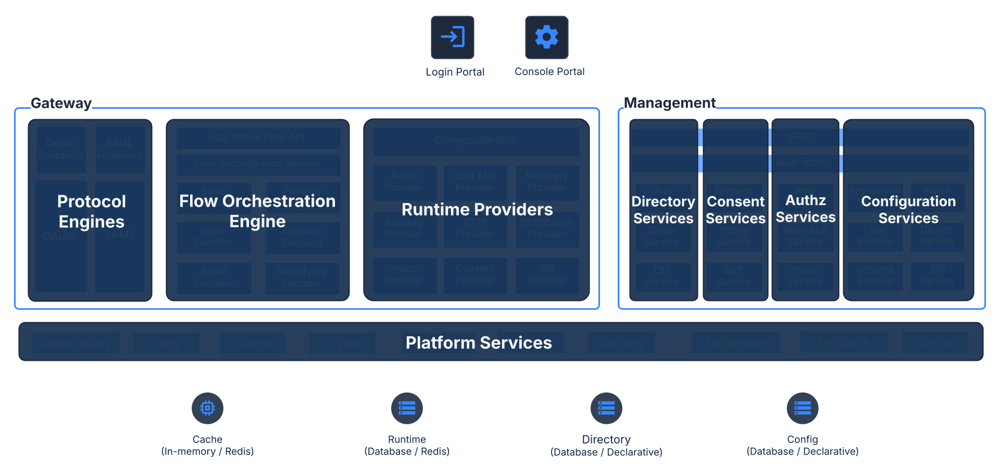

## ThunderID Project Proposal

ThunderID, an open-source Identity and Access Management stack for humans, AI agents, and machines.

# Sponsor(s)

* Selvaratnam Uthaiyashankar (Chief Product Officer \- WSO2) \- [shankar@wso2.com](mailto:shankar@wso2.com)   
* Sanjiva Weerawarana (Founder, Chairman & Chief Architect \- Lanka Software Foundation) \- [sanjiva@opensource.lk](mailto:sanjiva@opensource.lk)   
* Ramesh Narayanan (Chief Technology Officer \- Modular Open Source Identity Platform (MOSIP)) \- [ramesh@mosip.io](mailto:ramesh@mosip.io)

# Abstract

ThunderID is an open-source Identity and Access Management stack, built in Go, that secures humans, AI agents, and machines across traditional and decentralized identity ecosystems. It issues, verifies, and presents verifiable credentials over open standards, giving relying parties a practical path into decentralized trust.

# Context

ThunderID was initiated in 2025 May at [WSO2](https://wso2.com/) as a ground-up rethink of WSO2's 15+ years of work in the IAM domain, developed in the open at [https\://github.com/thunder-id/thunderid](https://github.com/thunder-id/thunderid) with contributions from WSO2 and from the [MOSIP](https://www.mosip.io/) team. ThunderID was previously accepted as a Growth-stage project in the OpenWallet Foundation. As the OpenWallet Foundation joins LF Decentralized Trust, WSO2 is contributing the entire project for neutral governance, and this proposal continues that path under LF Decentralized Trust.

ThunderID’s strong focus on decentralized identity creates a natural alignment with LFDT. One area that is particularly relevant to LFDT is decentralized identity. ThunderID provides issuer and verifier capabilities using OpenID4VCI and OpenID4VP with SD-JWT verifiable credentials. These capabilities are part of the same IAM stack as user management, authentication, sessions, token issuance, federation with external identity providers, and access policy enforcement.

The main idea is to connect wallet-based credentials with applications that already use OAuth and OpenID Connect. After a credential is issued or verified, the application can continue to consume a standard OAuth/OIDC authentication result without having to handle the underlying credential format itself. This allows organizations to introduce decentralized identity alongside their existing identity infrastructure rather than requiring applications to be rebuilt around a separate credential model.

LFDT already has projects covering important parts of the decentralized identity ecosystem, including Indy, Identus, AnonCreds, CREDEBL, and Trust over IP. ThunderID is intended to complement these projects by providing an IAM layer for issuing and verifying credentials and exposing the resulting identity to applications through standard OAuth/OIDC interfaces.

# Dependent Projects

ThunderID has no required dependency on another existing LF Decentralized Trust project.

# Motivation

Identity infrastructure was built on assumptions that no longer hold. IAM was designed to authenticate one kind of subject, human users, signing in to centralized applications, with federation to stretch that across domains. Two shifts have broken those assumptions at the same time.

The subjects have multiplied. AI agents now act on their own and on a user's behalf, initiating requests, calling services, and making decisions. IAM still treats them as service accounts and static API keys, with no real notion of an agent's identity, its delegated authority, or the consent it operates under. As agent-driven applications move into production, that gap turns into a security problem rather than an inconvenience.

Trust has started to decentralize. Verifiable credentials and DIDs are real and standardized, but adoption stalls on the relying party side. Issuing a credential is well understood. Consuming, verifying, and trusting one inside a running application still asks a service provider to assemble DID resolution, credential verification, trust registries, and issuer-verifier-holder flows on its own. Until that side is easy, decentralized identity stays a demo.

Underneath both shifts, the cryptography that IAM depends on has to survive the post-quantum transition, which means algorithms and key types can no longer be baked in.

Existing tools address these one bolt-on at a time. Traditional IAM platforms authenticate humans well and add agents and decentralized trust afterward, as adapters on a centralized core. Decentralized-identity toolkits handle issuance, wallets, and credential formats, but they are libraries and services rather than a full IAM runtime, and they leave relying-party integration to the adopter. Neither gives an organization a single system that covers humans, agents, and machines and bridges centralized and decentralized identity.

ThunderID is built ground-up for this. It treats humans, AI agents, and machines as first-class identities in one runtime, makes decentralized credentials practical to consume on the relying party side, exposes identity in a way agents can use natively, and rests on a crypto-agile foundation that can move to post-quantum algorithms as they mature. An organization can run it as a conventional IAM system today and move incrementally toward verifiable, agent-aware trust without replacing what it already has.

# Status

Incubation

ThunderID enters the LF Decentralized Trust lifecycle at the Incubation stage. It is already in production and open-source use, and the maintainers intend to work toward the criteria for Graduated status over time.

# Solution

ThunderID is an open-source, modern Identity and Access Management stack designed to secure humans, AI agents, and machines across traditional and decentralized identity ecosystems. Built from the ground up in Go, it is designed to deliver high performance, low latency, and a lightweight runtime footprint. It is designed with a developer-first mindset, prioritizing flexibility and ease of integration.

Core design goals of ThunderID includes:

**Agent-native identity:** ThunderID is designed for the agent era by managing AI agents as first-class identities and supporting identity lifecycle and controls for agent-driven use cases. This includes delegated authority, consent-aware access, traceability, and the ability to issue verifiable credentials for agents. ThunderID also aims to expose identity capabilities in a way that agents can use natively, enabling agent-driven applications and workflows to interact with IAM services safely and programmatically.

**Decentralized identity:** A key goal of ThunderID is to bridge the adoption gap on the relying party side, making it practical for service providers to consume, verify, and trust decentralized identity in real-world applications. This includes interoperability with DIDs, verifiable credentials, digital wallets, trust registries, and issuer-verifier-holder interaction models.

**Post-quantum-safe security:** ThunderID is designed for post-quantum readiness, supported by a crypto-agile foundation where algorithms, key types, signing methods, and token protection mechanisms can evolve over time. This includes support for post-quantum-safe algorithms and hybrid transition approaches across key management, credential issuance, assertions, and secure service-to-service communication.

**Lightweight runtime with GitOps support:** ThunderID is designed as a lightweight, containerized identity product that can be deployed across on-premises and cloud environments. It provides a declarative approach to defining identity flows, policies, and configurations, enabling IAM capabilities to be automated, versioned, and managed through GitOps practices.

Core capabilities today include:

* Manage identities for users, AI agents, and machines, along with their attributes and credentials.  
* Organize management of identity resources through a hierarchical organizational unit model.  
* Standard based authentication and authorization based on OAuth 2.1 and OpenID Connect specifications  
* Act as credential issuer, verifier, and relying party within verifiable credential ecosystems adhering to the OpenID for Verifiable Credentials family of specifications  
* A flow engine for orchestrating login, registration, account recovery, and step-up authentication flows with a wide variety of tools to be used in the flows to build the needed experience  
* Fine grained authorization and Policy based consent management  
* White labeling & localizing end user facing interfaces  
* Developer tools including Console UI, SDKs, APIs & MCP

Early adoption: ThunderID is already being integrated into production and open-source initiatives as a core identity component, including [MOSIP](https://www.mosip.io/) \- [eSignet](https://www.mosip.io/eSignet), [OpenChoreo](https://www.cncf.io/projects/openchoreo/), [WSO2 Agent Manager](https://wso2.github.io/agent-manager/docs/v1.0.0/concepts/agentid/), and [Lanka Software Foundation](https://github.com/LSFLK) projects.

### Standards support

ThunderID supports the following specifications:

* OAuth 2.0 Core (RFC 6749\)  
* OAuth 2.0 Bearer Token Usage (RFC 6750\)  
* Proof Key for Code Exchange by OAuth Public Clients, PKCE (RFC 7636\)  
* OAuth 2.0 Token Introspection (RFC 7662\)  
* OAuth 2.0 Authorization Server Metadata (RFC 8414\)  
* OAuth 2.0 Token Exchange (RFC 8693\)  
* OAuth 2.0 Resource Indicators (RFC 8707\)  
* Pushed Authorization Requests (RFC 9126\)  
* Dynamic Client Registration (RFC 7591\)  
* JSON Web Token, JWT (RFC 7519\)  
* JWT Profile for Access Tokens (RFC 9068\)  
* JSON Web Signature (RFC 7515\)  
* JSON Web Encryption (RFC 7516\)  
* JSON Web Key Set (RFC 7517\)  
* Demonstrating Proof-of-Possession (RFC 9449\)  
* OpenID Connect Core 1.0  
* OpenID Connect Discovery 1.0  
* OIDC Client-Initiated Backchannel Authentication

### Dependencies and licensing

ThunderID is a Go-based project. All runtime and build dependencies are under OSI-approved permissive licenses. The project is licensed under the Apache License, Version 2.0.

### Security

Security is handled through GitHub Private Vulnerability Reporting as the intake channel, a published security policy, and a public threat model. The crypto-agile foundation described above supports post-quantum and hybrid transitions. The maintainers are aligning the repositories to the OpenSSF Scorecard checks that LF Decentralized Trust uses for its lifecycle evaluation.

### **Architecture**

# Effort and Resources

Development is funded through in-kind engineering contributions, with no direct cash sponsorship. WSO2 initiated the project and is committed to continuing its engineering investment after the contribution. The MOSIP eSignet team contributes ongoing code and reviews. Alongside noticeable contributions from the wider community. 

The table below shows code contributors by organization, based on the [GitHub contributors page](https://github.com/thunder-id/thunderid/graphs/contributors?all=1).

| Organization | Code contributors |
| :---- | :---- |
| WSO2 | 68 |
| MOSIP | 5 |
| Independent / community | 17 |

Community engagement goes beyond code. ThunderID follows an open design process: every significant feature starts as a public [design discussion](https://github.com/thunder-id/thunderid/discussions/categories/design) on GitHub, and once a design is approved, a specification and threat model are written before development starts (see [Propose a Design](https://thunderid.dev/community/contributing/propose-a-design)). Threat models are also tracked in the open. This lets the community shape the project's architecture and security posture, not only its code.

As of September 2026:

* 262 GitHub Discussions, 140 of them design discussions, with 67 participants  
* 2,170 issues opened by 96 reporters  
* 581 stars and 382 forks

# How To

The quickest way to understand ThunderID is to run one of the scenarios it is built for. Each guide covers setup and a working end-to-end flow:

* Applications: secure a B2C application with the [Securing B2C Application guide](https://thunderid.dev/docs/next/use-cases/b2c/try-it-out).  
* AI agents: give an agent its own identity and delegated authority with the [Securing AI Agents guide](https://thunderid.dev/docs/next/use-cases/ai-agents/try-it-out).  
* Decentralized identity: see how verifiable credentials work in ThunderID with the [Decentralized Identity guide](https://thunderid.dev/docs/next/use-cases/vc/overview/).  
* MCP: authorize access to MCP servers with the [Securing MCP guide](https://thunderid.dev/docs/next/use-cases/ai-agents/mcp-authorization/try-it-out).

For the requirements and solution patterns behind these scenarios, see the [Use Cases](https://thunderid.dev/docs/next/use-cases/overview/) section. For installation and deployment options across local and cloud environments, see [Get ThunderID](https://thunderid.dev/docs/next/getting-started/get-thunderid/), with full documentation at [thunderid.dev](https://thunderid.dev).

# References

* ThunderID core source repository: [https\://github.com/thunder-id/thunderid](https://github.com/thunder-id/thunderid)  
* ThunderID documentation: [https\://thunderid.dev](https://thunderid.dev)  
* ThunderID Github organization: [https\://github.com/thunder-id](https://github.com/thunder-id)   
* ThunderID Community guide: [https\://thunderid.dev/community/overview](https://thunderid.dev/community/overview)   
* WSO2: [https\://wso2.com](https://wso2.com)   
* MOSIP: [https\://www\.mosip.io](https://www.mosip.io)   
* eSignet: [https\://www\.mosip.io/eSignet](https://www.mosip.io/eSignet)   
* OpenChoreo: [https\://www\.cncf.io/projects/openchoreo](https://www.cncf.io/projects/openchoreo)   
* Lanka Software Foundation: [https\://github.com/LSFLK](https://github.com/LSFLK) 

# Closure

We have not committed to fixed numeric targets at this stage. Success will be measured against the following goals:

* **Community:** Grow an active contributor community beyond the founding teams, with a healthy flow of issues, pull requests, reviews, and discussion.  
* **Sustainability:** Increase the organizational diversity of maintainers to reduce dependence on any one company, working toward the three-organization threshold required for Graduated status.  
* **Active Development:** Maintain a regular release cadence, moving from milestone-driven to time-boxed releases, and continue shipping fixes and features..  
* **Adoption:** Grow the number of production deployments and projects built on ThunderID beyond the initial set, and demonstrate relying-party consumption of verifiable credentials end to end against LF Decentralized Trust wallet and credential projects.  
* **Best Practices:** Adopt and sustain the open-source governance, security and quality practices expected by LF Decentralized Trust and OpenSSF, including SBOMs, signed releases, and the scorecard thresholds used for lifecycle evaluation.