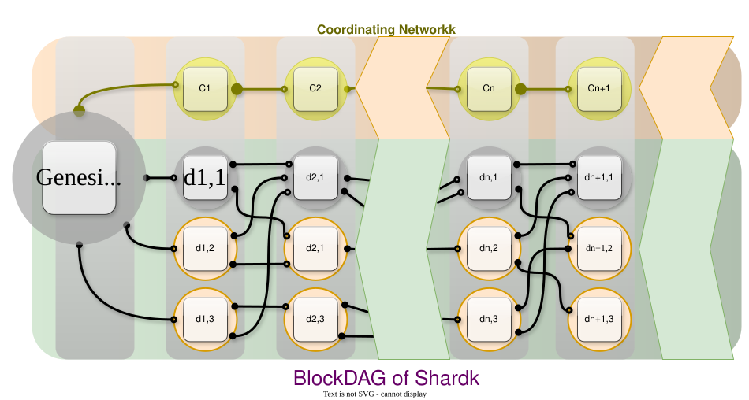

# Sponsor(s)

- Sergii Grybniak, PhD [<sergii@waterfall.network>](mailto:sergii@waterfall.network)
- Achikam Yogev [<achikam@waterfall.network>](mailto:achikam@waterfall.network)
- Dmytro Dmytryshyn, ScD [<dmitrishin@op.edu.ua>](mailto:dmitrishin@op.edu.ua)
- Michael Terpin [<michael@transformventures.io>](mailto:michael@transformventures.io)
- Richard Wang [<rwang@draperdragon.com>](mailto:rwang@draperdragon.com)
- Oleksandr Nashyvan [<on@waterfall.network>](mailto:on@waterfall.network)
- Ruslan Shanin, PhD [<ruslanshanin@onu.edu.ua>](mailto:ruslanshanin@onu.edu.ua)
- Volodymyr Mezin [<volodymyr@waterfall.network>](mailto:volodymyr@waterfall.network)

# Abstract

[Waterfall](https://waterfall.network/) is a highly scalable smart contract platform for the development of decentralized applications (DApps). The distributed protocol is based on DAG (Directed Acyclic Graph) technology, with Proof-of-Stake (PoS) consensus algorithm, in which millions of validators can participate. It challenges the trilemma of scalability, security, and decentralization by bringing the combination of scalability and decentralization on a new level.

Waterfall supports the Ethereum Virtual Machine (EVM) that all Ethereum-based apps can be run on this network. Therefore, Waterfall can ensure a favorable environment for the provision and consumption of a wide spectrum of enterprise-class services for government, enterprise and public activities, in a convenient format within the framework of a decentralized network.

# Dependent Projects

None.

# Motivation

A well-known problem that concerns both users and developers is that an increasing throughput, transactions per second (TPS), is usually in conflict with decentralization, and a balance should be found. Currently, the development of scalable networks with custom features has gained significant traction and it is considered one of the crucial factors for the mass adoption of DLTs, especially in enterprise-class applications including outside of finance (logistics, supply chain, ai agents coordination, etc.)

There are multiple approaches to overcome the limitation of scalability, among the most popular being sharding and Layer 2s (L2s). Sharding splits a distributed system into smaller, more agile systems, so it can handle more transactions. Layer 2 refers to a network or technology that operates on top of an underlying protocol to improve its scalability and efficiency. As a result, the entire system becomes decentralized and scalable. But when we split the whole into parts, its components suffer from the same decentralization and scalability tradeoff. Shard chains are essentially distributed systems. L2s are also mostly distributed systems, achieving scalability by sacrificing decentralization.

The prime goal of Waterfall is to provide a high-performance scalable ecosystem for the development of DApps in various fields such as DeFi, DePIN, GameFi, IoT, Enterprise, etc.

# Status

Proposed for Incubation.

The Waterfall Main network has been operating steadily since June 2024. [Current statistics](https://waterfall.network/individuals#statistics_block) are available online.

At present, our R&D team actively keeps on working on the system design including post-quantum cryptography, zero knowledge mechanisms for privacy, sharding and parallel processing. We aim to achieve a virtually unlimited number of shards, which can lead us to virtually unlimited scalability while preserving the decentralization of the entire system and each of its subsystems, making the statement "the more decentralized it is the more scalable it becomes" accurate.

# Solution

The efficiency of the Waterfall network is dependent on successful collaboration between the Coordinating and BlockDAG shards, which work in parallel. Every system validator has two essential components: the coordinator and the verifier, both playing key roles within their respective shards. Waterfall implementation provides for the possibility of deploying several autonomous validators on each node, with a common ledger and a pool of transactions. Such nodes are infrastructure objects deployed on separate devices (servers) and performing all operations for sending and processing data.

In a BlockDAG shard, all received transactions are first added to its DAG-based ledger and are applied to alter the network state only after they are finalized in the Coordinating network since the DAG structure does not have a natural ordering. A registry of verifiers is responsible for assigning block producers in each slot at the start of each epoch.

The Coordinating network handles the crucial tasks of linearizing (ordering) and finalizing the BlockDAG ledger, thereby enhancing security and synchronization across the entire system. This network also holds information about the approved blocks generated on the BlockDAG shard. Therefore, the execution of transactions and smart contract calls are separated from the consensus protocol.

For almost 2 years since launch, the network ranks top-5 (often top-3) by various performance mentics independently verified by Chainspect, providing major benefits for developers and enterprises. This high throughput ensures efficient processing, which is crucial for DeFi, IoT, Web3 gaming, and more. Currently, on Waterfall, several projects, including Lightning Works, Indigo Nexus LLC, and WaterSwap DEX, are in the technical documentation stage.

Further parallel processing hierarchical sharding will be intended to decrease the total computational network load and reduce volumes of stored data. The fractal structure provides exponential growth in the number of supported shards that will allow for virtually unlimited sharding. As a result, it will allow us to create an unlimited number of heterogeneous shards forming the fractality, with individual configurations covering numerous use cases in various fields that facilitate mass adoption of DLT, especially in IoT and robotics.

Waterfall utilizes the EVM (full compatibility). Smart contracts for Ethereum could be literally copied and pasted, although porting more complex applications may require changes in their code.

# Effort and Resources

[The Waterfall network](https://waterfall.network) was initiated in 2021 and after more than three years of development and testing, the Mainnet was successfully launched in June 2024. Throughout the development process, [the Waterfall team](https://waterfall.network/community/our-team) has made substantial contributions to the academic and professional community. To date, [17 reviewed scientific articles](https://waterfall.network/developers/research-papers) have been published, detailing various aspects of Waterfall.

The protocol's design originates in peer-reviewed doctoral research by Dr. Sergii Grybniak (recognized by IEEE TEMS TC on Blockchain & DLT and the NTU Centre in Computational Technologies as Outstanding Ph.D. Dissertation, presented at the 2025 Nanyang Blockchain Conference, Singapore).

The code is distributed under the Apache License v2.0. The project currently runs alongside Ethereum-native components licensed under LGPL-3.0 and GPL-3.0 as separate processes.

The code underwent [an independent audit by the Hacken team](https://audits.hacken.io/waterfall/l1-waterfall-network-node-apr2024/).

# Licensing Boundaries and Execution-Layer Replaceability

The Apache 2.0 components (`wf-types`, `wf-consensus`, `wf-engine`, `wf-coordinator`) do not statically bundle or link any GPL/LGPL code. The GPL/LGPL forks are isolated behind runtime boundaries and Apache 2.0-defined interfaces.

- **LGPL execution layer (`wf-go-ethereum`, a go-ethereum fork).** The Apache-licensed `wf-engine` does not statically link `wf-go-ethereum` at build time. On Linux it loads the execution layer at runtime as a shared-object plugin through an Apache 2.0 Go interface defined in `wf-types`. This keeps the LGPL code separable and replaceable, consistent with the LGPL's dynamic-linking expectations. The `wf-coordinator` sidecar additionally communicates with the execution layer over standard JSON-RPC.

- **GPL coordinator (`wf-prysm`, a Prysm fork).** Never linked into Apache-licensed code. It runs as an independent process and communicates only over gRPC - "mere aggregation" under GPL-3.0 §5.

**Direction.** Because the execution layer sits behind an Apache 2.0 interface and is already partially exposed over standard JSON-RPC, the boundary can, in the future, be refactored into a fully standard RPC interface. As Waterfall-specific logic continues migrating up into the Apache 2.0 modules, the remaining runtime execution dependency could then be served by an alternative - potentially Apache 2.0-licensed - execution client implementing that interface, rather than the current LGPL fork.

# How To

To interact with the network, including sending transactions and calling smart contracts, a user must install [an EVM-compatible wallet](https://docs.waterfall.network/getting-started/metamask/). Also, everyone can [run a mainnet node](https://docs.waterfall.network/tutorials/setup-docker-node-mainnet/) on his/her device or a cloud-based service for participating in the consensus and block validating. The minimum hardware requirements include a CPU with at least 4 cores and 12 GB of RAM. There is [a native app](https://docs.waterfall.network/tutorials/setup-native-node-app/) for MacOS and Windows and [infrastructure providers](https://waterfall.network/staking-infrastructure-providers) to facilitate the deployment process. The list of [developer tools](https://waterfall.network/developers) is constantly expanding.

# References

1. [Repository for types](https://github.com/waterfall-network/wf-types)
2. [Repository for engine](https://github.com/waterfall-network/wf-engine)
3. [Repository for consensus library](https://github.com/waterfall-network/wf-consensus)
4. [Repository for coordinator sidecar](https://github.com/waterfall-network/wf-coordinator)
5. [Repository for one-click app](https://github.com/LF-Decentralized-Trust-labs/waterfall-one-click-setup-app)
6. [Repository for Go-Ethereum fork](https://github.com/waterfall-network/wf-go-ethereum)
7. [Repository for Prysm fork](https://github.com/waterfall-network/wf-prysm)
8. [Waterfall research papers](https://waterfall.network/developers/research-papers)
9. [Waterfall Network on Medium](https://medium.com/@waterfall_network)
10. [Waterfall news](https://waterfall.network/community?news)
